# 往年考试总结

> 面向往年卷复习即可，如B+Tree、索引类型、SQL执行步骤都很重要
>
> 划的重点都必考
>
> 一共6道大题：4道简答，2道SQL；
>
> 最后一道附加题：谈谈上课印象深刻的知识点

## 简述DBMS对SQL解析执行的步骤

1. 语法分析：语法是否符合规范、表达式是否有含义
2. 语义分析：检查语句中的数据库对象是否存在、检查用户权限
3. 执行解析：解析部分是SQL优化过程中最消耗资源的部分
   1. 优化器对每一个表达式的等价变化生成解析树，然后进行评估，由优化器选择一个最优的执行路径来生成执行计划。
   2. 执行路径选择中会经历
      1. 视图转换：将设计视图的查询语句转换为相应的对基表查询语句
      2. 表达式转换：将复杂的SQL表达式转换为较简单的等效连接表达
      3. 选择优化器：不同的优化器一般产生不同的“执行计划”
      4. 选择连接方式表：Oracle有三种连接范式，对多表连接Oracle可选择适当的链接方式
      5. 选择连接顺序：对多表连接Oracle可选择适当的连接方式，
      6. 选择数据的搜索路径：根据以上条件选择合适的数据搜索路径，如是选用全表搜索还是利用索引或是其他方式。
4. 之后将选定的执行计划导入到执行引擎后在数据库中执行查询。
5. 将查询得到结果集进行返回

## 解释硬解析与软解析的含义和区别

1. 含义
   1. 硬解析指使用优化器对SQL进行优化，将SQL转化为一些等价语句，并选择代价最小的语句生成执行计划。
   2. 软解析是指共享池中已经存在有对应的执行计划，则不再进行优化，直接使用该执行计划。
   3. 硬解析代价最大，软解析代价较小。
2. 若在共享池中没有找到已有的执行计划则进行硬解析，否则进行软解析。
3. 运行执行计划，返回执行结构。运行执行计划的代价根据SQL语句的不同可大可小。

## 详细描述关于数据库范式和逆范式的以下几个问题

1. **什么是逆范式？**逆范式是为了放弃规范化，控制冗余

   1. 数据库逆范式 (Inverse 范式) 是一种数据库设计技术，它通过将关系中的数据与关系本身分离，使得关系中的列不再直接对应现实世界中的具体实体或概念，而是转换为这些实体或概念的抽象表示。这种分离使得关系型数据库可以实现更加高效和可扩展的数据管理。

2. **你认为判断何时该使用逆范式的条件有哪些？**系统有相对比较低的修改率和较高的查询率时可以选择打破范式。

   1. 情况1：合并一对一关系，可能会导致NULL、大量空间浪费等问题。
   2. 情况2：一对多关系复制非关键字属性，例如订单的金额和货品的金额，一般会使用触发器来同步修改属性。
   3. 情况3：一对多关系复制外部关键字，如果实体A访问实体C一定要通过实体B，那么我们可以在C中复制关键字A，直接关联避开B
   4. 情况4：多对多关系复制属性：将title、用户名等信息添加到关联关系中
   5. 情况5：引入重复组：引入地址、电话号码等，主表中可以存放一个缺省的地址和电话号码来避开连接查询
   6. 情况6：创建提取表：合并基本表和查找表
   7. 情况7：分区

   （ChatGPT）

   1. 实体之间不存在直接的关系：当实体之间不存在直接的关系时，使用逆范式可以更好地将实体的表示和数据的管理分离。
   2. 数据独立性较高：逆范式可以提高数据独立性，降低数据冗余和错误的风险。
   3. 数据量较大：当数据量较大时，逆范式可以实现更加高效和可扩展的数据管理。
   4. 需要高效的查询和管理：当需要高效的查询和管理数据时，逆范式可以实现更加简单和高效的查询算法。
   5. 实体之间有多种关系：当实体之间有多种关系时，逆范式可以将这些关系表示为不同的键值对，从而实现更加灵活和高效的数据管理。

## DBMS中索引有很多种，请简述下列问题

1. **位图索引的存储结构和用途**
   1. 存储结构：
      1. 位图索引的索引存储指向多行的指针。
      2. 位图索引每次进行修改都会锁住全部索引，对于低选择字段建议不要修改或尽可能小的修改。
   2. 用途
      1. 相异基数低：即字段可以取的值比较少
      2. 大量临时查询的聚合
   
2. **函数索引的含义和用途**
   1. 含义：函数索引也就是对F(x)的值构建索引，在通过对索引读取x所指向的记录行。
   2. 用途：
      1. 不区分大小写的查询：使用函数输入(构建一个全大写的函数索引)
         1. `Creat index emp_upper_idx on emp(upper(ename))`
         2. `Select * from emp where upper(name) = 'KING'`
      2. T、F的巨大差异下的索引：(True / False) 如何找到**少量**的F(函数索引：T映射到NULL，F映射到非空，然后对该函数建立索引，建立索引的结果全为False)
      3. 有选择的唯一性：Active的活动的名称不能相同`Create unique index active_project_must_be_unique on projects(case when status = 'ACTIVE' then name end)`，这样子只要有一个创建，另一个只能回滚。
   
   （ChatGPT）使用范围：
   
   1. 需要快速查找特定值的表。例如，订单表中的发货地址查询，需要快速查找特定地址的数据行。
   2. 需要对查询条件进行逻辑运算或其他计算的表。例如，需要对订单表中的发货时间进行计算，或者需要对订单表中的订单状态进行逻辑运算等。
   3. 需要对多个列进行匹配的查询。例如，需要对订单表中的多个地址列进行匹配的查询。
   
3. **反向键索引或叫逆向索引的含义和用途**
   1. 含义：将索引的字段翻转过来作为索引的键值
   2. 用途：用来解决高并发下的系统生成键的创建和插入问题。
   
4. **还有哪些索引类型，请简要描述**
   1. 哈希索引
      1. 哈希索引的结构：哈希索引是对索引键值进行哈希计算，将得到的结果作为键值创建索引
      2. 哈希索引的适用范围
         1. 哈希索引支持全键值查询、=、in、不等于等运算
         2. 哈希索引不支持部分键值匹配、排序、原字段顺序查询
      3. 如何避免哈希冲突：使用二次哈希法或者链表法(参考HashMap)

## B+ Tree索引是大多DBMS默认的索引类型，请详细描述以下几个问题

1. **B+树的结构**

   1. 有K个子树的中间节点包含K个元素，每个节点不保存数据，只保存索引，所有的数据都存储在叶子节点。
   2. 所有叶子节点中包含了全部元素的信息，以及指向含这些元素记录的指针，并且叶子节点本身按照关键字大小自小而大顺序链接。

2. **B+树支持的查询**

   1. 全键值查询 Where x = 123 (depth + 1次的固定次数)
   2. 键值范围 Where 45 < x < 123 (先进行x=45，然后顺序读取直到x>=123)
   3. 键前缀查找 where x LIKE J%’

3. **B+树的使用范围**

   1. 仅需要通过索引访问基本表的一部分(检索的结果集与集体的百分比为10%以下)
   2. 如果要处理表中的多列，可以使用索引而不使用表

4. **为什么系统的为外键构建索引是普遍的要求**

   1. 建立外键索引可以更快速地保证数据的一致性：比如A持有B的外键，B删除记录时需要检查A中的相应行，如果没有外键索引的话则需要对A进行全表遍历，而建立外键索引则可以更快速的完成。
   2. 建立外键索引可以避免死锁：还是如上所说，如果对A全表遍历耗时很长，可能会导致其他进程与之死锁导致双双失败。
   3. 例外：如果表很少被修改或者表很小，则可以不必建立外键索引。

5. **有没有例外情况？**

   1. 如果表很小或者很少被修改，则不必建立；因为使用索引非常占用磁盘空间；

6. **请描述Oracle中一种类似于B树索引的组织形式索引组织表（IOT）的基本结构和应用范围**

   （以下回答来自ChatGPT）

   1. IOT 的基本结构如下:

      1. 一个 IOT 表包含一个或多个内部表，这些内部表通常包含相同的列，但这些列的值在 IOT 表中是唯一的。
      2. 每个内部表都包含一个或多个指针，这些指针指向 IOT 表中的其他内部表。
      3. IOT 表的外部表包含一个或多个索引，这些索引用于快速查找指向内部表的指针。

      IOT 的应用范围非常广泛，包括但不限于以下几个方面:

      1. 大数据集的高效查询:IOT 表可以有效地管理大数据集，并支持快速查询。由于 IOT 表使用索引组织，因此可以快速定位和访问数据。
      2. 数据合并和归一化:IOT 表可以用于数据合并和归一化，因为这些表使用相同的列来存储数据，并且这些列的值在 IOT 表中是唯一的。这使得数据合并和归一化变得更加高效。
      3. 数据备份和恢复:IOT 表可以用于数据备份和恢复，因为这些表可以用于快速定位和访问数据。在数据备份和恢复过程中，IOT 表可以帮助快速找到需要备份的数据。
      4. 数据管理和分析:IOT 表可以用于数据管理和分析，因为这些表可以用于快速定位和访问数据。IOT 表可以帮助用户快速找到他们需要的数据，从而加快数据分析过程。

## （代码题）船只租赁

详见[题解](https://blog.csdn.net/NextCodemonster/article/details/116330013)

1. 编写一个sql语句，找出年龄在35以上的并且在2020-09-01至2020-09-30期间没有预定红色（RED）船只的水手，结果返回水手姓名sname。

   ```sql
   select
     s.sname
   from
     sailors s
   where
     s.age > 35
     and not exists(
       select
         *
       from
         reserves r,
         boats b
       where
         r.sid = s.sid
         and r.bid = b.bid
         and b.color = "RED"
         and r.reserve_date between '2020-09-01'
         and '2020-09-30'
     )
   ```

2. 编写一个sql语句，找出年龄在35岁以上，并且在2020-08-01至2020-08-31期间同时预定了红色船（RED）和绿色船（GREEN）的水手，结果返回水手姓名sname。

   ```sql
   select
     sname
   from(
       select
       distinct  s.sname
       from
         sailors s,
         reserves r,
         boats b
       where
         r.sid = s.sid
         and r.bid = b.bid
         and b.color = "GREEN"
         and r.reserve_date between '2020-08-01'
         and '2020-08-31'
         and s.age > 35
     ) as t1
   where
     exists(
       select
       distinct  s.sname
       from
         sailors s,
         reserves r,
         boats b
       where
         r.sid = s.sid
         and r.bid = b.bid
         and b.color = "RED"
         and r.reserve_date between '2020-08-01'
         and '2020-08-31'
         and s.age > 35
     )
   ```

3.  编写一个sql语句，找出预定了所有船的水手，结果返回水手姓名sname。

   //TODO

## 对于将层次数据（树状结构）存储到关系表中，详细回答以下问题

1. **设计三种存储设计方案**

   1. Adjacency model 邻接模型

      1. 表的每一行描述一个部队，parent_id指向树中的上级部队

      1. 这种方案的优点很明显：结构简单易懂，由于互相之间的关系只由一个parent_id维护，所以增删改都是非常容易，只需要改动和他直接相关的记录就可以。

      1. 缺点当然也是非常的突出：由于直接地记录了节点之间的继承关系，因此对Tree的任何CRUD操作都将是低效的，这主要归根于频繁的“递归”操作，递归过程不断地访问数据库，每次数据库IO都会有时间开销。举个例子，如果想要返回所有水果，也就是水果的所有子孙节点，看似很简单的操作，就需要用到一堆递归。

         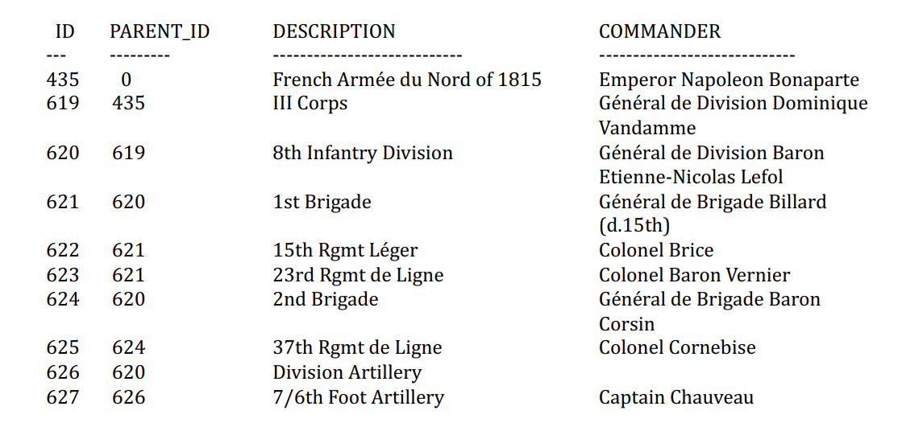

   2. Materialized path model 物化路径模型

      1. 表中有两个索引，在materialized_path上的唯一性索引以及在commander上的索引，正确的设计应该增加id字段

      1. 此方案的缺点是树的层级太深有可能会超过PATH字段的长度，所以其能支持的最大深度并非无限的。

      1. 如果层级数量是确定的，可以再将所有的列都展开，如下图，比较适用于于类似行政区划、生物分类法（界、门、纲、目、科、属、种）这些层级确定的内容。

         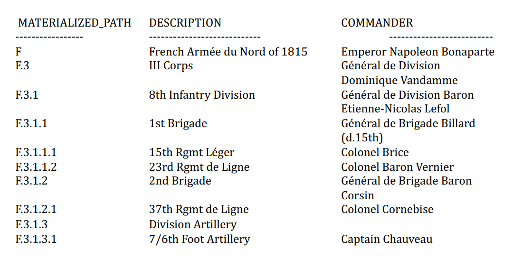
   
   3. Nested set model 嵌套集合模型
   
      1. 每一个节点被赋予了一对数字(left number, right number)
   
      2. 按次序遍历整个树结构，经过每个节点两次，每次赋一个序号，因此根节点是(1,2N)，N是结点数
   
      2. 数字从小到大就是对这棵树进行前序遍历的顺序
      
      2. 本方案的优点是查询非常的方便，缺点就是每次插入删除数据涉及到的更新内容太多，如果树非常大，插入一条数据可能花很长的时间。所以不推荐，了解下就行，也不打算深入研究，想研究的可以查其他资料。
      
         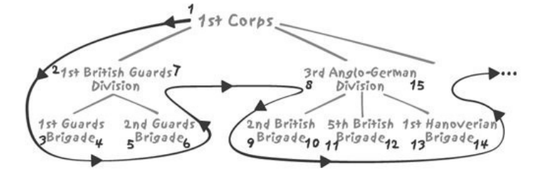
         
         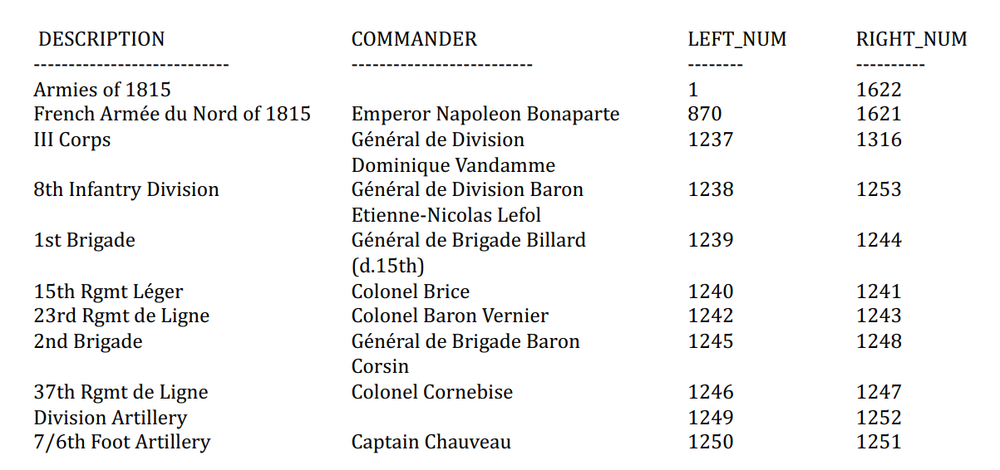

## （代码题）商城关系模式

详见[题解](https://blog.csdn.net/m0_37302219/article/details/104856124)

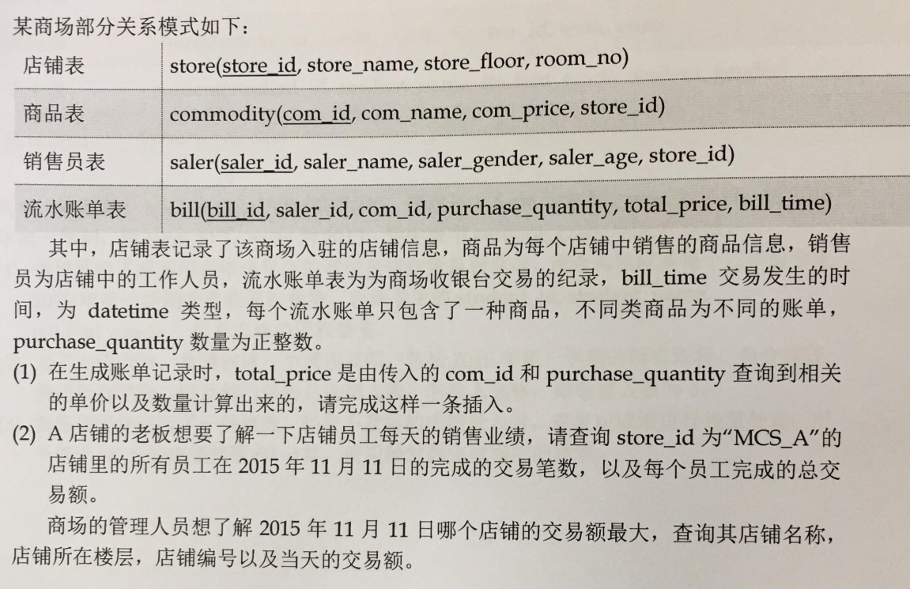

## （代码题）教师表、课程表、学生表、选课情况

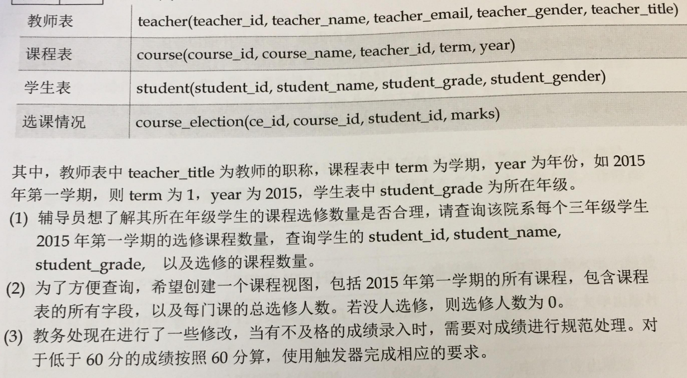

## （代码题）Circo

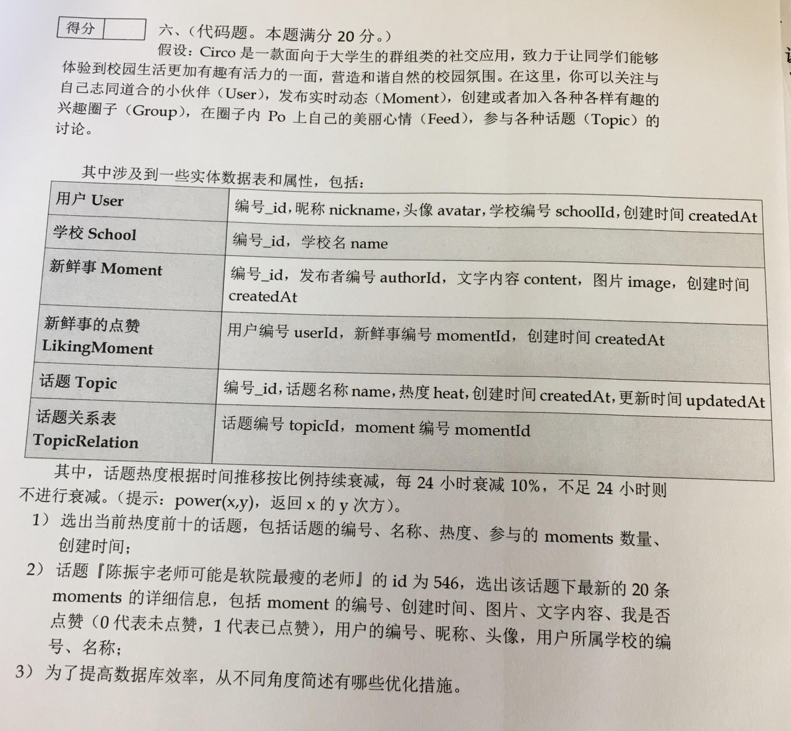

## 试题回忆

1. 为性能而设计：a.没有好的设计 b.数据库之间的差别很大 c.知道一些提高数据库性能的方法（比如异步和同步）好和坏的方面
2. sql优化：买BMW的优化(仔细看那道BMW的题，有类似的题，估计只会改一点点)

3. 为什麽要使用索引，为什麽没有使用索引，举例

4. 物理组织的优化（如何访问堆文件，过程是什麽），堆文件和IOT，分区的特性

5. 处理层次结构，数据库设计（3种模型：邻接，物化路径，嵌套集合：比较优劣和适合的场景）

6. ER模型到表结构是一个完整的映射，1对1（部分参与），1对多（部分参与），多对多。
7. 基本上只要上课听过他讲的就没有什麽问题，看一遍就够了应该

## 为什么说关系数据库比层状/网状数据库更科学

1. 层次性数据库最早出现：存在逻辑嵌套，而不是线性排列，适用于部分场景，耦合性过强限制了我们对数据的自由操作
2. 网状数据库(多层次连接)：灵活多了，但是数据操作还是困难。
3. 关系型数据库在灵活性、数据访问、数据的组织找到了很好的平衡点，是场景普适的存储方式，对于特定的存储不太合适

## 关系理论认为，数据中不应该有重复数据，记录之间也不存在顺序关系。在现实的关系型数据库中又是如何处理的

1. 关系理论不包含重复数据，不然无法保证一致性。然而很多中间结果集包含重复数据。因为：关系是处理无限数据集的，但是数据库处理的是有限数据集。有限数据集不仅需要保证正确，还需要提高效率。
2. 额外：关系理论中，记录没有顺序。现实的关系型数据库中顺序存放记录使得效率提高

## 关系理论中的空值和实际关系型数据库中空值的处理有何差异

1. 关系理论中的空值和实际关系型数据库中空值的处理存在一些差异。
2. 在关系理论中，空值被认为是一种数据类型，与整型、字符型等数据类型相同。空值可以表示缺失值或未指定值，它在关系型数据库中通常使用 NULL 来表示。NULL 是一种特殊的值，它表示未知或未指定的情况。在关系理论中，NULL 被认为是一种实体状态，而不是一种数据类型。
3. 相比之下，实际关系型数据库中通常不使用空值作为数据类型。在数据库中，空值通常用 NCLOB 或 CLOB 等大对象类型来表示。在查询和分析中，空值通常被视为一种特殊的数据，需要特殊处理。例如，在 SQL 查询中，可以使用 IS NULL 和 IS NOT NULL 等关键字来检查查询结果是否包含空值。
4. 此外，关系理论中通常使用模式来描述数据，而实际关系型数据库中通常使用表和索引等机制来描述数据。在关系理论中，数据模式可以包含空值，而在实际应用中，空值通常被排除在数据模式之外。
5. 因此，关系理论中的空值和实际关系型数据库中空值的处理存在差异。在关系理论中，空值被视为一种数据类型，而在实际应用中，空值通常被视为一种特殊的数据，需要特殊处理。

## 高并发下的为确保性能，锁的解决方案是什么样的？解决资源竞争有哪些方法

（ChatGPT）

1. **解决方案**
   1. 读写锁：用于保证读写操作之间的隔离性。在读操作时，会获取读锁，确保在读操作期间其他写操作无法执行。当读操作完成后，读锁会被释放。写操作时会获取写锁，确保在写操作期间其他读和写操作无法执行。写锁通常是互斥的，即一个写操作获取写锁后，其他写操作必须等待直到当前写操作完成。
   2. 读写分离：将读写操作分离到不同的实例上，从而提高系统的并发能力和性能。
   3. 乐观锁：在多个客户端同时访问同一数据时，采用乐观锁机制可以保证数据的一致性。乐观锁是指客户端在获取数据时，首先获取乐观锁，确保在获取锁期间其他客户端无法访问该数据。当客户端获取到锁后，可以更新数据或插入数据，当锁被释放后，其他客户端可以再次获取锁并更新或插入数据。
   4. 悲观锁：在多个客户端同时访问同一数据时，采用悲观锁机制可以保证数据的一致性。悲观锁是指客户端在获取数据时，会获取该数据的悲观锁，确保在获取锁期间其他客户端无法访问该数据。当客户端获取到锁后，可以更新数据或插入数据，当锁被释放后，其他客户端无法获取该锁，从而保证数据的一致性。
2. **解决资源竞争的方法包括:**
   1. 线程池：将线程放入线程池中，避免线程频繁创建和销毁，从而提高系统的性能和稳定性。
   2. 资源分配器：在创建资源时，先将资源分配给资源分配器，确保资源能够被及时释放。
   3. 缓存：将数据缓存在内存中，避免频繁读取数据库，从而提高系统的响应速度和性能。
   4. 异步处理：将异步处理应用于资源竞争场景，确保资源能够被及时释放，从而提高系统的性能和稳定性。
   5. 并发队列：将数据放入并发队列中，保证多个客户端能够并发访问数据，从而提高系统的并发能力和性能。

## 关系数据库、数据仓库、NoSQL的发展演化和内在联系是什么样的

（ChatGPT）

1. 发展演化和内在联系如下:
   1. 关系数据库：关系数据库 (Relational Database) 是最早出现的数据库类型之一，它使用表格来存储数据，每个表格包含行和列。关系数据库中的数据以关系型结构存储，因此得名。关系数据库的核心技术是关系型查询语言 (SQL),它允许用户对数据库进行结构化查询和操作。关系数据库是最常用的数据库类型之一，广泛应用于企业级应用和电子商务等领域。
   2. 数据仓库：数据仓库 (Data Warehouse) 是一种集中存储大量数据，并提供快速查询和数据挖掘的数据库。数据仓库通常采用多维数据模型 (OLAP) 技术，以便用户能够快速进行数据分析和数据挖掘。数据仓库的核心思想是将数据从不同的源系统中抽取，存储在集中的位置，以便用户进行数据挖掘和分析。数据仓库广泛应用于企业级应用、金融、医疗保健等领域。
   3. NoSQL 数据库:NoSQL 数据库 (Not Only SQL) 是一种非关系型数据库，它不使用 SQL 作为查询语言，而是使用其他类型的数据存储和查询语言。NoSQL 数据库通常是分布式的，可以处理大量的结构化和非结构化数据。NoSQL 数据库的发展是为了解决关系数据库在处理大规模数据时的性能和扩展性问题。NoSQL 数据库广泛应用于大数据处理、实时数据处理、物联网等领域。
2. 关系数据库、数据仓库和 NoSQL 数据库是三种不同类型的数据库，它们的发展演化和内在联系是:
   1. 关系数据库是最早的数据库类型之一，它适用于处理结构化数据，但在面对大规模数据和高并发访问时性能下降明显。
   2. 数据仓库是一种集中存储大量数据并提供快速查询和数据挖掘的数据库，它适用于需要对大量数据进行分析和挖掘的领域，如企业级应用、金融、医疗保健等。
   3. NoSQL 数据库是为了解决关系数据库在处理大规模数据时的性能和扩展性问题而发展起来的，它适用于需要处理大量非结构化数据的领域，如大数据处理、实时数据处理、物联网等。

## 数据库的四种事务隔离级别是什么，分别举例说明，并简要说明脏读、不可重复读、幻读

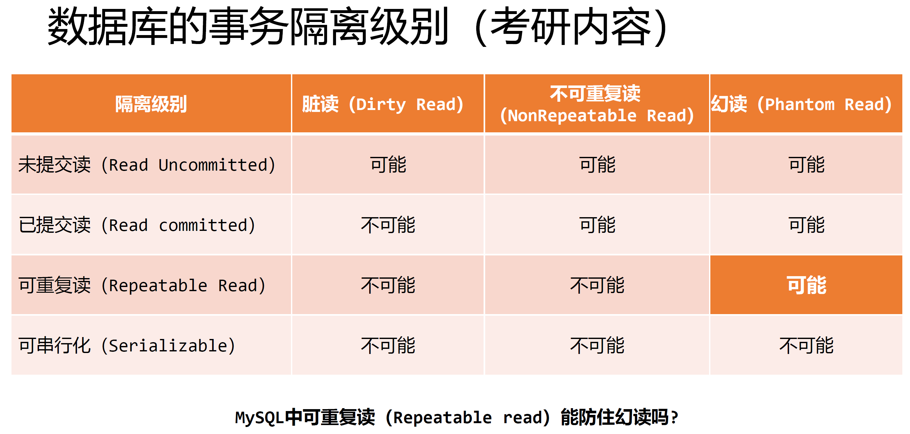

1. **脏读：读到了其他事务未提交的数据**
2. **不可重复读：执行SELECT操作时没有获得读锁或SELECT操作值执行完成后立刻释放了锁，而另一个事务对数据进行更新得到了不同的结果**
3. **幻读；不可重复读的一种特殊场景，事务1两次Select检索一定范围内的数据，事务2在两次之间创建了一条新的符合检索条件的记录，导致两次查询的结果集不同**

（ChatGPT）

1. 读未提交 (Read Uncommitted)
   1. 在这种隔离级别下，读取事务尚未提交的数据。这意味着读取的数据可能是不一致的，因为其他事务正在修改数据。这种隔离级别通常用于开发测试环境，以测试应用程序在不同隔离级别下的行为。
   2. 例如，一个测试人员可能会在测试环境中使用读未提交隔离级别，以便在测试过程中读取尚未提交的数据，以便更好地测试应用程序的行为。
2. 读已提交 (Read Commited)
   1. 在这种隔离级别下，只能读取已提交的数据。这意味着读取的数据是已经提交并排序的，因此其他事务修改的数据不会被读取。这种隔离级别是最常用的，因为它提供了最好的数据一致性和可靠性。
   2. 例如，一个电子商务应用程序可能会使用读已提交隔离级别，以便在用户购买商品时读取已提交的数据，以便更好地为用户提供个性化的购物体验。
3. 未提交读 (Read Uncommitted)
   1. 在这种隔离级别下，可以读取其他未提交的事务的数据。这种隔离级别通常用于测试环境中，以便测试应用程序在不同隔离级别下的行为。
   2. 例如，一个测试人员可能会在测试环境中使用未提交读隔离级别，以便在测试过程中读取其他未提交的事务的数据，以便更好地测试应用程序的行为。
4. 提交读 (Read Commited)
   1. 在这种隔离级别下，可以读取已提交的数据，但只能读取一个事务提交时的数据。这种隔离级别通常用于生产环境，因为它提供了最好的数据一致性和可靠性，同时避免了未提交读隔离级别下的脏读问题。
   2. 例如，一个金融应用程序可能会使用提交读隔离级别，以便在客户进行交易时读取已提交的数据，以便更好地为客户提供服务。

## 关系理论如何决定SQL优化的？请简要说明

（ChatGPT）

  1. 数据模型设计：在关系理论中，数据模型是数据库的基础。设计一个好的数据模型可以帮助数据库管理员和开发人员提高查询性能。在设计数据模型时，应该考虑数据的完整性、一致性和可用性。
  2. 关系模型选择：关系模型是数据库管理系统中最常用的模型之一。在选择关系模型时，应该考虑数据实体之间的关系、数据量、查询复杂度等因素。常用的关系模型有 UML 图、ER 图、关系图等。
  3. SQL 查询优化:SQL 查询是数据库管理系统中最重要的操作之一。优化 SQL 查询可以提高查询性能，减少数据库资源的占用。在优化 SQL 查询时，应该考虑查询语句的结构、查询条件、索引选择等方面。
  4. 数据库设计优化：在数据库设计中，应该考虑数据的存储方式、表之间的关系、索引设计等方面。优化数据库设计可以提高查询性能，减少数据库资源的占用。

## 解决资源竞争的方法有哪些？

- DBA解决方案：与业务逻辑弱相关或无关
  - 事务空间：调整事物锁占空间的大小，事务条目占用是重要原因，DBA可以增加分配给事务条目的空间来解决；
  - 可用列表：insert操作在不同物理块中，可以借助存储管理手段；
- 架构解决方案：
  - 分区；
  - 逆序索引；减少竞争点
  - 索引组织表：原本资源竞争包括基本表和索引，但是现在索引和基本表合并了，可以降低冲突发生的位置；
- 开发解决方案
  - 调节并发数：限制最高的session数量；多加session反倒会增加管理成本；
  - 不适用系统产生键：如果键没有意义，不妨使用随机值，range需要足够大；碰撞


# 2023重点

总分110分

- 100分对应课程分数60%

- 额外10分，说出上课印象深刻的知识点

- 总共6道题+1道附加题

### 视图的两个场景

- 控制权限
- 更新数据库的时候满足原来应用的访问

### 不能把数据库当成黑盒使用，为什么？

- 数据库是不同的。在一个数据库上取得的经验也许可以部分应用于另一个数 据库，但是必须有心理准备，二者之间可能存在一些基本差别，可能还有一 些细微的差别
- 细微的差别（比如对NULL的处理）与基本差别（如并发控制机制）可能有 同样显著的影响。 
- 应当了解数据库，知道它是如何工作的，他的特性如何实现，这是解决这些 问题的唯一途径

### 锁机制，不一致性读

//TODO

### 空值问题

- 空值可能被当作一个特殊的值，也可能被当作”unknown“
- 比较空值必须用IS NULL和IS NOT NULL
- 可以使用nvl()函数处理空值，语法格式如：NVL( var, replace_with)，如果第一个参数为null，返回后一个参数

### 基于磁盘的索引结构

- 对于特定数据结构，有些更适用于磁盘，有些更适用于内存
- 平台级软件，和硬件的关系非常大（操作系统，数据库，嵌入式，芯片）
- **为什么不使用二分搜索树而是用B+树**
  - **高扇出，以改善临近键的数据局限性**
  - **低高度，以减少遍历期间的寻道次数**


### B-Tree结构

- 叶节点分裂的情况

- 非叶节点分裂的情况

  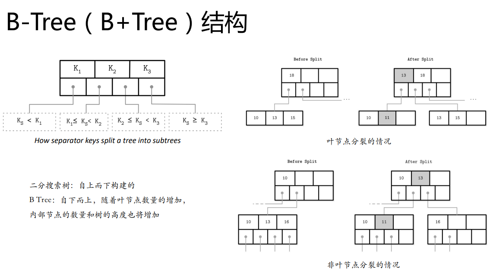

### 索引对数据的访问只是第一步，两种方式，为什么？

- 读取基本表中的数据才是查询的结束。
- 同样的索引，但不同的物理结构，可能会引起查询效率 的千差万别。
- **第一种方法，更新数据两边都要修改**
- **第二种方法，只要更新一边，每次访问都要过一次主键索引，即多一次IO操作**

- 不考哈希索引

### 分槽页的好处

需求：

1. 最小开销的变长存储需求
2. 回收已删除记录的空间
3. 引用页中的记录，无论记录在哪

优点：

1. 最小开销：分槽页唯一的额外开销是一个指针数组，用于保存记录实际所在位置的偏移量
2. 空间回收：通过对页进行碎片整理和重写，就可以回收空间
3. 动态布局：从页外部，只能通过槽ID来引用槽，而确切的位置是由页内部决定的

### 单元格的布局

- 溢出的迁移

  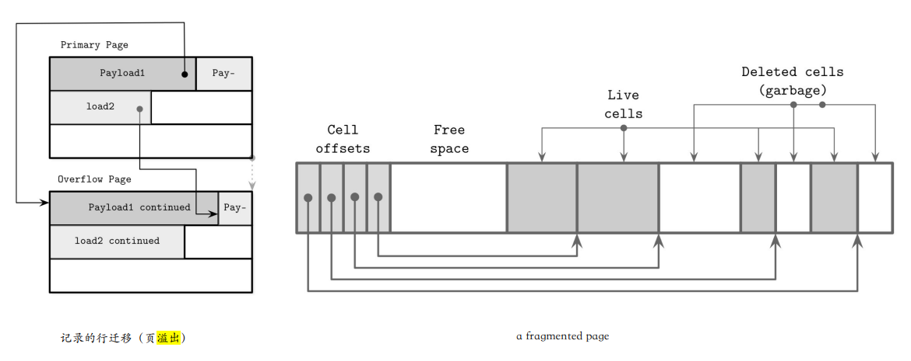

### 为什么有freeblock（三七分，避免行迁移）

使用空闲块的策略

1. 首次适配优先：找第⼀个适配的空闲块，会带来额外开销
2. 最佳适配优先：找⼀个剩余段最小的空间

### SQL题

- 一道是SQL练习题，考试系统还出错了

- 大概是船只租赁那题，如下

  ```sql
  # 编写一个sql语句，找出年龄在35岁以上，并且在2020-08-01至2020-08-31期间同时预定了红色船（RED）和绿色船（GREEN）的水手，结果返回水手姓名sname。
  select
    sname
  from(
      select
      distinct  s.sname
      from
        sailors s,
        reserves r,
        boats b
      where
        r.sid = s.sid
        and r.bid = b.bid
        and b.color = "GREEN"
        and r.reserve_date between '2020-08-01'
        and '2020-08-31'
        and s.age > 35
    ) as t1
  where
    exists(
      select
      distinct  s.sname
      from
        sailors s,
        reserves r,
        boats b
      where
        r.sid = s.sid
        and r.bid = b.bid
        and b.color = "RED"
        and r.reserve_date between '2020-08-01'
        and '2020-08-31'
        and s.age > 35
    )
  ```

  

### SQL题

1. 删除不想要的字符（replace函数）

   1. 把数据库表article中的所有title字段里的w3cschool字符串替换成hello。

      ```sql
      UPDATE `article` set title=replace(title,'w3cschool','hello');
      ```

2. 计算平均值，空值的处理

   1. AVG函数默认忽略空值所在行

   2. 加上COALESCE(SAL, 0)将空值置为0

      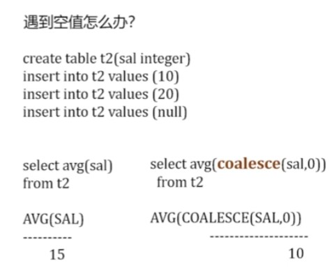
   
3. 计算中位数

   1. MySQL and PostgreSQL
   
      ```sql
      select avg(sal)
      from(
        select e.sal
          from emp e, emp d
          where e.deptno = d.deptno and e.deptno = 20
          group by e.sal
          having sum(case when e.sal = d.sal then 1 else 0 end)
          		>= abs(sum(sign(e.sal-d.sal)))
      );
      ```
   
   2. Oracle
   
      ```sql
      select median(sal)
      from emp
      where deptno=20
      ```
   
      
   

### 散步在各层的百分比（魔药）

```sql
select	connect_by_root recipe_id root_recipe,
		recipe_id,
		prior	pct,
		pct
		component_id
from	composition
connect	by	recipe_id =	prior	component_id
```


### BOM问题如何存储

**该技术（嵌套集合模型）**的出现解决了标准关系代数和关系演算以及基于它们的SQL操作不能直接在层次结构上表示所有期望操作的问题。层级可以用parent-child relation (父子关系)术语来表示 - Celko称之为 [adjacency list model]，但是如果可以有任意的深度，这种模型不能用来展示类似的操作比如比较两个元素的层级或者确定一个元素是否位于另一个元素的子层级，当一个层级结构是固定的或者有固定的深度，这种操作必须通过每一层的 [relational join](https://link.zhihu.com/?target=http%3A//en.wikipedia.org/wiki/Join_(relational_algebra)%23Joins_and_join-like_operators) （关系连接）来实现。但是这将很低效。这通常被称为**物料清单问题（Bill Of Material问题，BOM）**。