# Linux程序设计复习

> （重点大概覆盖考试内容的80%）


## ch1-1 Linux Basics

> 概念会出开放性简答题，大概一道，分值10分以内

### What is Linux

- A free Unix-type operating system developed under the GNU General  Public License.
- 一个在GNU通用许可证下开发的免费的类Unix操作系统。
- 特点：开源，流行，支持多平台

### 历史

- 1984: Richard Stallman starts GNU project
- Purpose: Free UNIX（这里的free指自由的）
- First step: re-implementation of UNIX Utilities
  - C compiler, C lib
  - emacs
  - bash
- To fund the GNU project, the Free Software Foundation is founded.

- 1991: Linux Torvalds writes 1st version of Linux kernel.
- 1992: First distrubutions emerge

### 发行版

- Ubuntu, Debian, Mint, Red Hat, Fodore, SuSe, Mandrake, Redflag

### 协议

- 大多数软件都是GPL'ed，即遵守GPL协议的
- 又称为”copyleft“
- **可自由复制，可自由分发，可以用来盈利，可自由修改**。
- 必须在收费前向你的客户提供该软件的 GNU GPL 许可协议，以便让他们知道，他们可以从别的渠道免费得到这份软件，以及你收费的理由。

### MBR(Master Boot Record)

- 大小固定，512 bytes（hd的第一个扇区）
- BIOS标准
- 内容
  - 主引导程序 446 bytes program code (to boot an OS)
  - 硬盘分区表 64 bytes partition table with max. 4 entries
  - 结束标志位 2 bytes “magic number” (0x55AA)
- 支持4个主分区，每个分区最大不能超过2TB

### GPT(GUID Partition Table Scheme)

- UEFI标准
- 每个分区都有一个全局唯一的标识符
- GPT方式支持磁盘划分128个分区，每个分区可达18EB容量

### 文件系统

- 操作系统中负责存取和管理文件的部分
- Linux文件系统
  - VFS
  - EXT2，EXT3，FAT32

### Boot loader

- GRUB (**GR**and **U**nified **B**ootloader)
  - 位置：存在MBR (first stage) 和/boot/grub (1.5th and second stage)
  - 作用：
    1. 理解文件系统结构，不需要激活配置
    2. 配置文件存在/boot/grub/grub.conf
    3. 借助grub-install安装在MBR

### 配置菜单(了解)

### 编译开源软件流程(了解)

- tar zxvf application.tar.gz
- cd application
- mkdir build
- cd build
- cmake ..
- make VERBOSE=1
- su -
- make install

### 命令行提示符（了解）

- 支持自定义
- $ - “logged in as a regular user”
- \# - “logged in as root”

### linux常用命令（重点）

- ls –l(-d, -R, -a, -i)
- passwd 修改用户密码
- mkpasswd 生成随便密码
- date, cal 日期
- who, finger 查看其他登录用户
- clear 清屏
- echo
- write, wall, talk, mesg 给其他用户发消息

### 文件类型

- 普通文件 regular file [-]
- 字符设备文件 character special file [c]
- 块设备文件 block special file [b]
- 套接字文件 socket [s]
- 链接文件 symbolic link [l]
- 目录文件 directory [d]

### 目录结构（掌握主要目录）

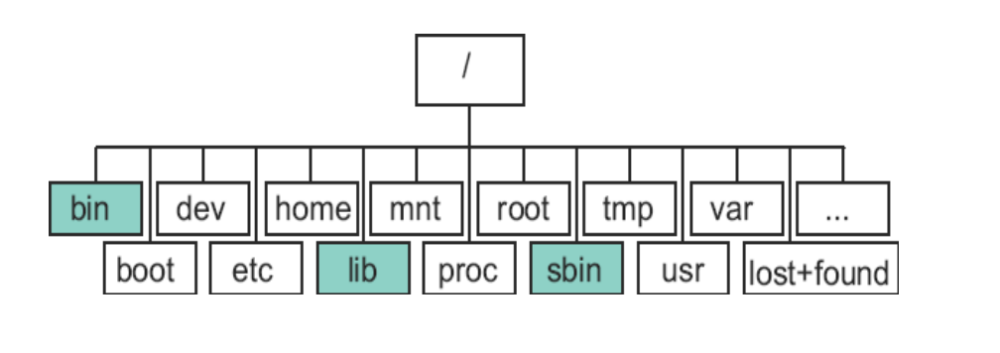

### 基础命令（掌握）

#### 操作目录的命令

- pwd
- cd
- mkdir
- rmdir
- ls

#### 操作文件的命令

- touch
- cp
- mv
- ln
- rm
- cat
- more/less

### 文件权限（掌握）

- 三种访问级别
  - user
  - group
  - others
- 三种权限
  - read (r)：读文件内容 / 查看目录中有哪些文件
  - write (w)：修改文件内容 / 删除和创建目录内文件
  - execute (x)：执行文件 / 可以cd进入目录，能访问目录内文件内容

### chmod

- ```shell
  chmod <who operator what> filename
  ```

- who

  - u = owner / user
  - g = group
  - o = others

- operator

  - \+ = add permission
  - \- = remove permission
  - = = clear permissions and set to mode specified

- what

  - r = read
  - w = write
  - x = execute

- example:

  ```shell
  chmod 765 file
  chmod +x script.sh
  ```

- 文件默认权限
  - File：-rw-r--r--  644
  - Directory：drwxr-xr-x  755

### 进程概念（了解）

- A process is a task.
- 进程是一个正在执行的程序实例。由执行程 序、它的当前值、状态信息以及通过操作系 统管理此进程执行情况的资源组成。

- 进程相关命令：ps, pstree, jobs, kill, nohup(在后台运行), nice(带优先级执行程序)

### linux层次图

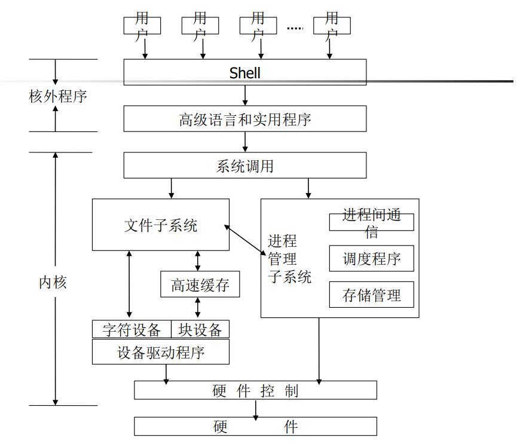


## ch1-2 Linux Basics2

### 基本命令

#### 文件操作

- ls, dir, vdir
- mkdir
- cp, mv, rm
- chmod, chown, chgrp, touch
- find
- grep(egrep)
- pwd, cd, ar, file, tar, more, less, head, tail, cat

#### 进程操作

- ps, kill, jobs, fg, bg, nice

#### 其他

- who, whoami, passwd, su, uname
- man

### 重定向（重点）

- 标准输入、标准输出、标准错误
  - 对应的文件描述符：0，1，2
  - C语言变量：stdin，stdout，stderr
- <, > (相当于1>), >>, 2>

### 管道（重点）

- 一个进程的输出作为另一个进程的输入

### 环境变量（可能会出一道题目，混在编程题里面）

- 查看和设置环境变量
  - echo, env, set

### 高级命令

- find
- sed
- grep

### 正则（作业中有，不会考很难）


## ch2 Shell Programming

（分值20分以内）

### 各种不同的shell

- bash, ash, csh, tcsh, ksh

### 编写脚本文件

- 注释 `# !/bin/bash`

- 退出码 `exit 0`

- 例

  ```shell
  #!/bin/bash
  # Here is comments
  for file in *; do
    if grep –l POSIX $file; then
      more $file
    fi
  done
  
  exit 0 
  ```

### 执行脚本文件方法

1. `sh example.sh`
2. `chmod +x example.sh` ; `./example.sh`
3. `source example.sh` ; `./example.sh`

### read

- 类似scanf，读取一个标准输入

- 用法：read var 或 read

- read得到的输入默认保存为$REPLY变量

- 例子

  ```shell
  # example 1
  read name
  echo "hello $name"
  
  # example 2
  read -p "Enter your name:" name
  
  # example 3
  read -p "Enter a number"
  echo $REPLY
  
  # -t timeout
  read -t 5 -p "please enter your name:" name 
  
  # -n NCHARS 读入NCHARS个字符立即处理，不需要回车
  read -n1 -p "Do you want to continue [Y/N]:" answer
  
  # -s 不回显输入内容（可用于输入密码时）
  ```

### 单引号双引号

- 单引号内的所有字符都保持它本身字符的意思，而不会被bash进行解释，例如，\$就是\$本身而不再是bash 的变量引用符；\就是\本身而不再是bash的转义字符
- 双引号中的$var会被解析成变量的值
- 除了$、``（反引号）和\外，双引号内的所有字符将保持字符本身的含义而不被bash解释
- 转义符 ”\“

### 环境变量

- export
- env
- set
- unset

### 变量

- 用户变量
  - 用户在shell脚本里定义的变量
  
- 环境变量

- 参数变量和内部变量
  - 调用脚本程序时如果带有参数，对应的参数和额外产生的一 些变量。
  
  - 如
    - $#：参数个数
    
    - $0：脚本名，相对路径
    
      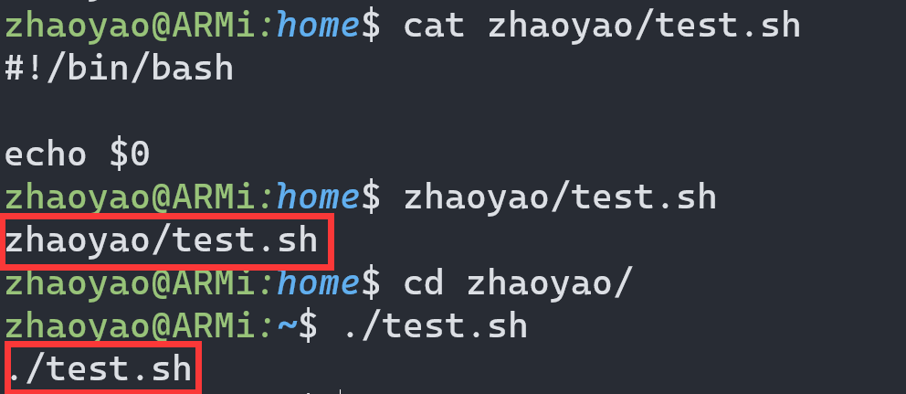
    
    - $1, $2, ...：参数
    
    - $*：参数集合
    
    - $@：$*的一种变体，不使用IFS环境变量

### 条件测试

- 详见`man test`

- 和文件相关的条件判断语句

  ```shell
  -e FILE
     FILE exists
  
  -f FILE
     FILE exists and is a regular file
  
  -d FILE
     FILE exists and is a directory
     
  -s FILE
     FILE exists and has a size greater than zero  
     
  -r FILE
     FILE exists and read permission is granted
     
  -w FILE
  FILE exists and write permission is granted
  
  -x FILE
     FILE exists and execute (or search) permission is granted
     
  FILE1 -ef FILE2
  	FILE1 and FILE2 have the same device and inode numbers
  
  FILE1 -nt FILE2
  	FILE1 is newer (modification date) than FILE2
  
  FILE1 -ot FILE2
  	FILE1 is older than FILE2
  ```

- 和字符串相关的

  ```shell
  -n STRING
  	the length of STRING is nonzero
  
  -z STRING
  	the length of STRING is zero
  
  STRING1 = STRING2
  	the strings are equal
  
  STRING1 != STRING2
  	the strings are not equal
  ```

- 整数比较

  ```shell
  INTEGER1 -eq INTEGER2
  	INTEGER1 is equal to INTEGER2
  
  INTEGER1 -ge INTEGER2
  	INTEGER1 is greater than or equal to INTEGER2
  
  INTEGER1 -gt INTEGER2
  	INTEGER1 is greater than INTEGER2
  
  INTEGER1 -le INTEGER2
  	INTEGER1 is less than or equal to INTEGER2
  
  INTEGER1 -lt INTEGER2
  	INTEGER1 is less than INTEGER2
  
  INTEGER1 -ne INTEGER2
  	INTEGER1 is not equal to INTEGER2
  ```

- 逻辑操作与或非

  ```shell
  ! EXPRESSION
  	EXPRESSION is false
  
  EXPRESSION1 -a EXPRESSION2
  	both EXPRESSION1 and EXPRESSION2 are true
  
  EXPRESSION1 -o EXPRESSION2
  	either EXPRESSION1 or EXPRESSION2 is true
  ```

### if语句

- 形式

  ```shell
  if [ expression ]
  then
      statements
  elif [ expression ]
  then
      statements
  elif …
  else
      statements
  fi
  ```

- ; 紧凑形式

### case语句

- 注意行末;;

- 形式

  ```shell
  case str in
    str1 | str2) statements;;
    str3 | str4) statements;;
    *) statements;;
  esac
  ```

### for语句

- 形式

  ```shell
  for var in list
  do
      statements
  done
  ```

### while语句

- 形式

  ```shell
  while [ condition ]
  do
    statements
  done
  ```

### until语句（不推荐）

- 形式

  ```shell
  until condition
  do
  statements
  done
  ```

### select语句

- 形式

  ```shell
  select item in itemlist
  do
    statements
  done
  ```

- 作用：生成菜单列表

### 命令组合

- 分号串联 command1 ; command2 ; ...
- 条件组合 &&, ||

### 函数

- 例子1 local变量

  ```shell
  foo() {
      local bar=1
      echo "local $bar"
  }
  
  foo
  echo "global $bar"
  
  # 程序输出:
  # local 1
  # global
  ```

- 例子2 函数传参

  ```shell
  foo() {
      echo "$1, $2"
  }
  
  foo 22 23
  
  # 程序输出:
  # 22, 23
  ```

### 整数运算，$(())

- 例子

  ```shell
  # 程序输出
  # num1 = 23 + 1
  # num2 = 24
  
  num="23"
  
  num1="$num + 1"
  
  num2=$((num + 1))
  
  echo "num1 = $num1"
  
  echo "num2 = $num2"
  ```

### 杂项

#### 杂项命令

- break: 从for/while/until循环退出；
- continue: 跳到下一个循环继续执行；
- exit n: 以退出码”n”退出脚本运行；
- return: 函数返回；
- export: 将变量导出到shell，使之成为shell的环境变量；
- set: 为shell设置参数变量；
- unset: 从环境中删除变量或函数；
- trap: 指定在收到操作系统信号后执行的动作；
- “:”(冒号命令): 空命令；
- “.”(句点命令)或source: 在当前shell中执行命令

#### 捕获命令输出：$()和``

- 相同点，对于命令，效果相同

  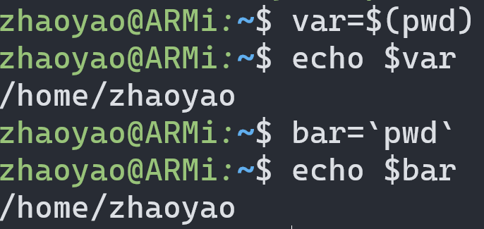

- ``不能取变量，()

#### 算术扩展，$(())

#### 参数扩展

- 问题: 批处理 1_tmp, 2_tmp, …

- 方法 

  ```shell
  #!/bin/sh 
  i=1 
  while [ “$i” –ne 10 ]; do 
      touch “${i}_tmp” 
      i=$(($i+1)) 
  done 
  exit 0
  ```

- 更复杂的形式

  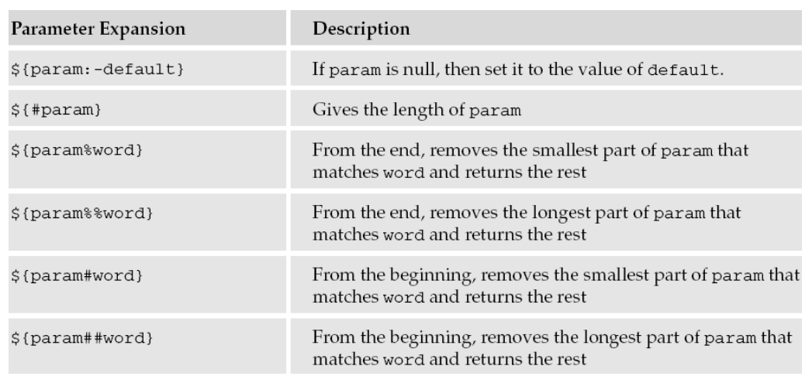

#### 即时文档（掌握）

- 在shell脚本中向一条命令传送输入数据

- 例子

  ```shell
  #!/bin/bash
  cat >> file.txt << EOF
  Hello, this is a here document.
  EOF
  ```


## ch3-0 Programming Prerequisite

elf格式

- Excutable and Linkable Format

- 工具接口标准委员会(TIS)选择了正在发展中的ELF体系上 不同操作系统之间可移植的二进制文件格式

### 程序设计语言（解释型 or 编译型）

- 编译型语言代表有：C、C++、Swift
- 解释型语言代表有：Javascript、MATLAB、PHP，Python、Ruby

### 编译链接图（会和问答题混在一起）

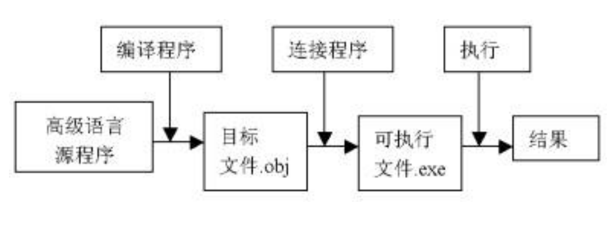

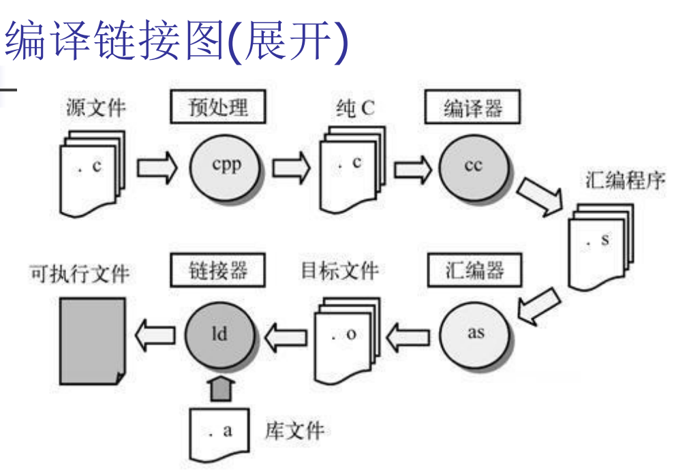

### 静态库与动态库

静态库的代码在编译的过程中已经载入到可执行文件中，所以最后生成的可执行文件相对较大。

动态库的代码在可执行程序运行时才载入内存，在编译过程中仅简单的引用，所以最后生成的可执行文件相对较小。

### gcc命令（掌握参数）

- gcc -c (编译)
- gcc (链接 或者 编译 + 链接)
- g++ (C++对应的命令，其实就是换了前端)
- 常用选项
  - -E: 只对源程序进行预处理(调用cpp预处理器)；
  - -S: 只对源程序进行预处理、编译；
  - -c: 执行预处理、编译、汇编而不链接；
  - -o output_file: 指定输出文件名；
  - -g: 产生调试工具必需的符号信息；
  - -O/On: 在程序编译、链接过程中进行优化处理；
  - -Wall: 显示所有的警告信息；
  - -Idir: 指定额外的头文件搜索路径；
  - -Ldir: 指定额外的库文件搜索路径；
  - -lname: 链接时搜索指定的库文件
  - -DMACRO[=DEFN]: 定义MACRO宏

### 文件拓展名

- .c：C源码
- .cpp：C++源码
- .h：C或C++头文件
- .o：Object file
- .s：Assembler code

### gdb（主观题）

- 功能
  - 设置断点
  - 监视变量值
  - 单步执行
  - 修改变量值
- 原理
  - GDB（GNU调试器）是一个用于调试程序的工具。它的工作原理是基于ptrace系统调用。ptrace系统调用提供了一种方法，使一个程序（追踪者）能够观察和控制另一个程序（被追踪者）的执行，并检查和改变被追踪者的内存和寄存器。这样，GDB就能够控制被调试程序的执行顺序，从而达到调试的目的。
- 命令
  - file 打开要调试的文件
  - bread/tbreak 设置断点/设置临时断点
  - run 执行
  - list 列出源代码的一部分
  - next 执行一条语句但不进入函数内部
  - step 执行一条语句，如果是函数调用就进入函数内部
  - display 显示表达式的值
  - print 临时显示表达式的值
  - kill 中止程序
  - quit 退出
  - shell 不退出gdb就执行shell命令
  - make 不退出gdb就执行make

### Makefile

（ppt涉及的内容要掌握，可能和编程题混在一起考，程序写完写一个makefile，复杂机制不考）

- makefile描述模块间的依赖关系
- make命令根据makefile对程序进行管理和维护；make判断被维护文件的时序关系

- 例子

  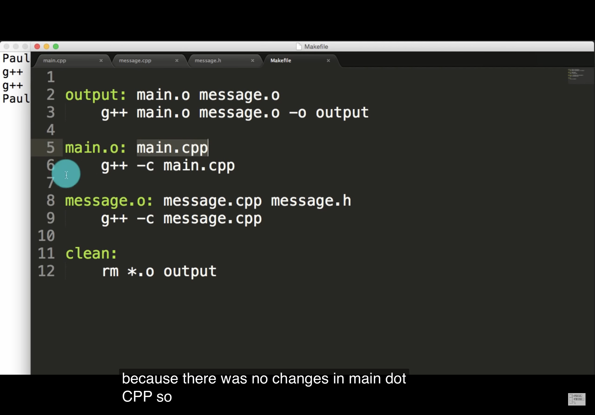

- 预定义变量

  


## ch3-1 System Programming

### 文件系统三层含义

（可能简答题）

1. 指一种特定的文件格式。例如，我们说Linux的文件系统是Ext2，MSDOS的文件系统是FAT16，而Windows NT的文件系统是NTFS或FAT32，就是指这个意思。
2. 指按特定格式进行了”格式化“的一块存储介质。当我们说”安装“或”拆卸“一个文件系统时，指的就是这个意思。
3. 指操作系统中（通常在内核中）用来管理文件系统以及对文件进行操作的机制及其实现，这就是本章的主要话题。

### 七种文件类型（掌握）

- regular file；
- character special file；
- block special file；
- fifo；
- socket；
- symbolic link；
- directory

### VFS基本原理（了解）

- Virtual File System Switch (VFS)

- **VFS模型在内核里面创建的四种对象，分别代表什么意思（重要）**
  1. **super block**：超级块
  2. **i-node object**：inode对象
  3. **file object**：文件对象
  4. **dentry object**：目录项对象

### 硬链接软连接（重点）

- Hard link
  - 不同的文件名对应同一个inode
  
  - 不能跨越文件系统
  
  - 对应系统调用link
  
    ```shell
    ln source.txt link.txt
    ```
  
- Symbolic link
  - 存储被链接文件的文件名（而不是inode）实现链接
  
  - 可跨越文件系统
  
  - 对应系统调用symlink
  
    ```shell
    ln -s source.txt link.txt
    ```

### 系统调用

（看清题目，要求用系统调用就不能用库函数）

- 都以C函数的形式出现
- 系统调用
  - Linux内核的对外接口; 用户程序和内核之间唯一的接口; 提供最小接口
  - 有open、close、creat、read、write、lseek、dup、dup2、fcntl、ioctl
- 库函数
  - 依赖于系统调用; 提供较复杂功能
  - 标准I/O库

- **分清系统调用和库函数（重点）辨别方法**

### 系统调用

（掌握，容易考编程题）

- open函数，掌握最常用的

  ```c
  int fd = int open(const char *pathname, int flags);
  //flags: f O_RDONLY, O_WRONLY or O_RDWR
  ```

- 文件不能忘记close

  ```c
  #include <unistd.h>
  int close(int fd);
  //Return: 0 if success; -1 if failure
  ```

- 处理文件的流程：open-read/write-[lseek]-close

- read

  ```c
  #include <unistd.h>
  ssize_t read(int fd, void *buf, size_t count);
  //(返回值: 读到的字节数，若已到文件尾为0，若出错为-1)
  ```

- write

  ```c
  #include <unistd.h>
  ssize_t write(int fd, const void *buf, size_t count);
  //(返回值: 若成功为已写的字节数，若出错为-1)
  ```

### 库函数

- fopen、fclose

  ```c
  #include <stdio.h>
  FILE *fopen(const char *filename, const char *mode);
  //mode: "r","w","a","r+","w+","a+"
  
  int fclose(FILE *stream);
  //(Return: 0 if success; -1 if failure)
  ```

- fread，fwrite（掌握）

  ```c
  #include <stdio.h>
  size_t fread(void *ptr, size_t size, size_t nmemb, FILE *stream);
  /*
  buffer:是读取的数据存放的内存的指针（可以是数组，也可以是新开辟的空间，buffer就是一个索引）
  size:是每次读取的字节数
  nmemb:是读取次数
  stream:是要读取的文件的指针
  返回成功读取的元素总数
  */
  
  size_t fwrite(const void *ptr, size_t size, size_t nmemb, FILE *stream);
  /*
  buffer:是一个指针，对fwrite来说，是要获取数据的地址；
  size:要写入内容的单字节数；
  count:要进行写入size字节的数据项的个数；
  stream:目标文件指针；
  返回实际写入的数据项个数count。
  */
  ```

- getc,fgetc,getchar

  ```c
  #include <stdio.h>
  int getc(FILE *fp);
  int fgetc(FILE *fp);
  int getchar(void);
  ```

- putc,fputc,putchar

  ```c
  #include <stdio.h>
  int putc(int c, FILE *fp);
  int fputc(int c, FILE *fp);
  int putchar(int c);
  ```

- printf，scanf掌握

  ```c
  #include <stdio.h>
  int scanf(const char *format, ...);
  int fscanf(FILE *stream, const char *format, ...);
  
  int printf(const char *format, ...);
  int fprintf(FILE *stream, const char *format, ...);
  ```

- fseek，ftell，rewind（至少掌握一个）

  ```c
  #include <stdio.h>
  /*
  stream -- 这是指向 FILE 对象的指针，该 FILE 对象标识了流。
  offset -- 这是相对 whence 的偏移量，以字节为单位。
  whence -- 这是表示开始添加偏移 offset 的位置。它一般指定为下列常量之一：
  */
  int fseek(FILE *stream, long int offset, int whence);
  
  //返回给定流 stream 的当前文件位置
  long ftell(FILE *stream);
  
  //设置文件位置为给定流 stream 的文件的开头
  void rewind(FILE *stream);
  ```

- flush（掌握）

  ```c
  //刷新文件流。把流里的数据立刻写入文件
  #include <stdio.h>
  int fflush(FILE *stream);
  
  ```

### 临时文件

- Create a name for a temporary file 

  ```c
  #include <stdio.h>
  char *tmpnam(char *s);
  //(返回值: 指向唯一路径名的指针) 
  ```

- Create a temporary file

  ```c
  #include <stdio.h>
  FILE *tmpfile(void); 
  //(返回值: 若成功为文件指针，若出错为NULL)
  ```

### struct stat

- 看红色和蓝色标注的

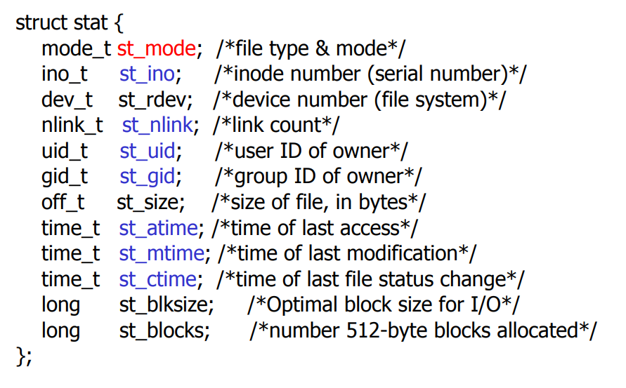

### 文件权限（重点）

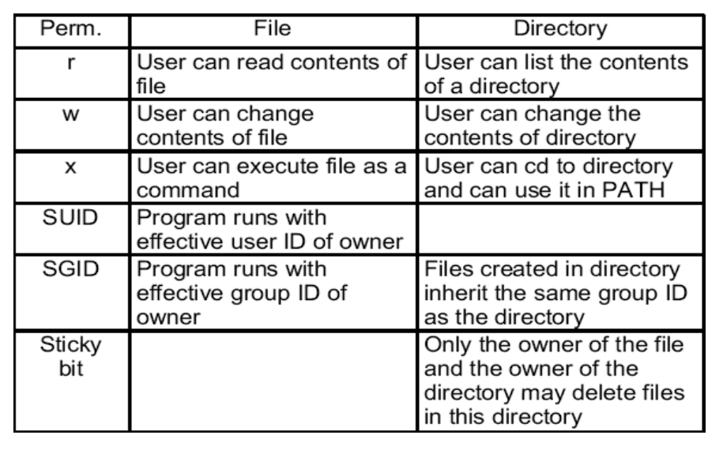

### 修改权限（重点）

- chmod

  ```c
  int chmod(const char *path, mode_t mode);
  ```

- chown

  ```c
  int chown(const char *path, uid_t owner, gid_t group);
  ```

### 硬链接/软链接（重点）

- link

  ```c
  #include <unistd.h>
  int link(const char *oldpath, const char *newpath);
  //(Return: 0 if success; -1 if failure)
  ```

- unlink

  ```c
  #include <unistd.h>
  int unlink(const char *pathname);
  //(Return: 0 if success; -1 if failure)
  ```

- symlink

  ```c
  #include <unistd.h>
  int symlink(const char *oldpath, const char *newpath);
  //(Return: 0 if success; -1 if failure)
  ```

### 目录操作（会写代码）

- mkdir 创建空目录

  ```c
  #include <sys/stat.h>
  #include <sys/types.h>
  int mkdir(const char *pathname, mode_t mode);
  //(Return: 0 if success; -1 if failure)
  ```

- rmdir 删除空目录

  ```c
  #include <unistd.h>
  int rmdir(const char *pathname);
  //(Return: 0 if success; -1 if failure)
  ```

- cd 改变工作目录

  ```c
  #include <unistd.h>
  int chdir(const char *path);
  int fchdir(int fd);
  //(Return: 0 if success; -1 if failure)
  ```

### 文件锁（重点）

- 类型
  - 记录锁
  - 劝告锁
    - 检查，加锁由应用程序自己控制

  - 强制锁
    - 检查，加锁由内核控制
    - 影响open()、read()、write()等 

  - 共享锁
  - 排他锁


### fcntl记录锁（掌握）

- 用于记录锁的fcntl函数原型

  ```c
  #include <unistd.h>
  #include <fcntl.h>
  int fcntl(int fd, int cmd, struct flock *lock);
  //(返回值: 若成功则依赖于cmd，若出错为-1)
  ```

### 其他加锁命令

- lockf

  ```c
  #include <sys/file.h>
  int lockf(int fd, int cmd, off_t len);
  ```


## ch4-2 Kernel Driver

### 内核简介（掌握）

- 概念：操作系统是一系列程序的集合，其中最重要的部分构成了内核

- 功能：内存管理，文件系统，进程管理，多线程支持，抢占式，多处理支持

- 层次结构

  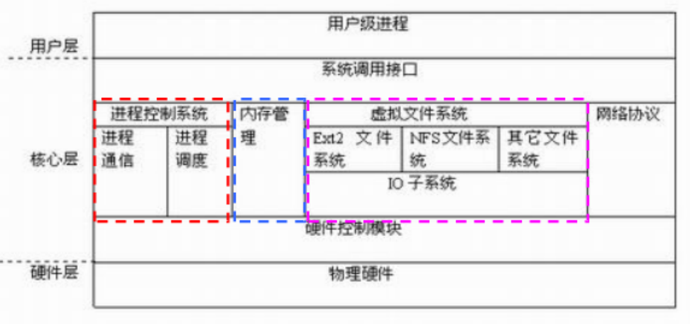

### 驱动，模块（重点）

- 驱动的形式
  - 许多常见驱动的源代码集成在内核源码里
  - 也有第三方开发的驱动，可以单独编译成模块.ko
  
- 加载模块的命令
  - 底层命令
    - insmod 加载模块**（需要sudo）**
    - rmmod 删除模块

  - 高层命令
    - modprobe
    - modprobe -r

- 模块依赖（掌握）
  - 一个**模块A引用另一个模块B**所导出的符号，我们就说**模块B被模块A引用**。
  - **如果要装载模块A，必须先要装载模块B**。否则，模块B所导出的那些符号的引用就不可能被链接到模块A中。这种模块间的相互关系就叫做**模块依赖**。

- moddep，lsmod，modinfo的作用
  - moddep：分析可加载模块的依赖性，生成modules.dep文件和映射文件
  - lsmod：显示当前内核加载的所有模块，**等价于cat /proc/modules**
  - modinfo：显示内核模块的信息

- 模块通讯（掌握）
  - 模块是为了完成某种特定任务而设计的。其功能比较的单一，为了丰富系统的功能，所以模块之间常常进行通信。其之间可以共享变量，数据结构，也可以调用对方提供的功能函数。


### Linux内核模块与应用程序的区别

> （可能出问答题，大致写出三点以上）

|      | C语言程序 | Linux内核模块      |
| ---- | --------- | ------------------ |
| 运行 | 用户空间  | 内核空间           |
| 入口 | main()    | module_init()指定  |
| 出口 | 无        | module_init()指定  |
| 运行 | 直接运行  | insmod             |
| 调试 | gdb       | kdbug, kdb, kgdb等 |

- 一共9个点，写出来4点就够了（？）

### 注意点

- 不能使用C库来开发驱动程序
- 没有内存保护机制
- 小内核栈
- 并发上的考虑

### 内核代码

> 只要求能读


## 华为openEuler（15分）

> 考试会有判断题（eg：openEuler是一个专用系统❌），会有多选和单选，不考代码
>

### 重点

- 开源社区：openEuler是一个**开源**linux发行版，也是一个开源平台
- 背景：**2019年底**EulerOS被正式推到开源社区，成为OpenEuler
- 通用架构：支持**x86**和**ARM**等多种处理器架构
- 鲲鹏处理器：基于**ARMv8-64指令集**开发的**通用**处理器
- openEuler是一款基于Linux内核的**通用**操作系统；
- 为了充分发挥鲲鹏处理器的优势，openEuler在**多核调用技术、软硬件协同、轻量级虚拟化、指令级优化和智能优化引擎**等方面做了增强。
- **乱序执行**：为了提高性能，现代CPU利用流水线技术在一个时钟周期内会执行多条指令，并且不一定按照软件中规定的顺序执行，称为乱序执行。
- openEuler使用**多队列调度策略**

- **iSulad**
  - iSulad是一个轻量级容器引擎，采用C/C++语言实现，相比其它容器引擎，它的内存开销更小，并发性能更高
  - iSulad容器引擎主要包括以下几个模块：
    - 通信模块：支持**gRPC/RESTFUL两种通信方式**，提供对外通信的能力；
    - 镜像模块：支持OCI标准镜像，提供content/metadata、rootfs及snapshot管理能力；
    - 运行时模块：支持轻量级Runtime(lcr)和OCI标准的Runtime(runc，kata等)。

- **A-Tune**
  - 整体上是一个C/S架构
  - 客户端atune-adm是一个命令行工具，通过gRPC协议与服务端atuned进程进行通讯；
  - 服务端中atuned包含了一个前端gRPC服务层(采用golang实现)和一个后端服务层；
  - A-Tune的两个能力
    - **智能决策**
    - **自动调优**

- 支持的**通信机制**：openEuler支持**共享内存**与**消息传递**两个机制

- **内存管理预测机制**

- 大量用了**寄存器**

- 使用了经典指令集**RISC**

- **没有神经网络**

- **对鲲鹏处理器的优化**：
  1. 多核调度
  2. 软硬件协同
  3. Isulad
  4. A-Tune

### 思考题

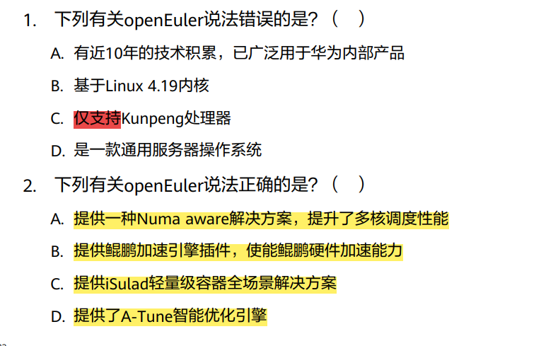
