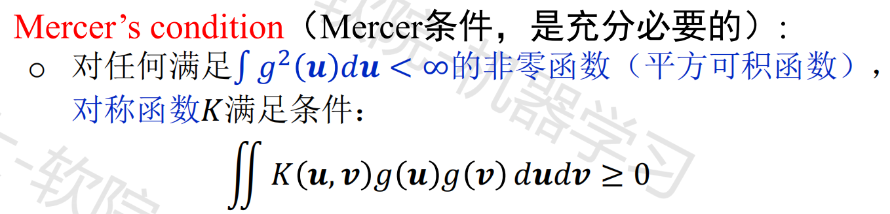
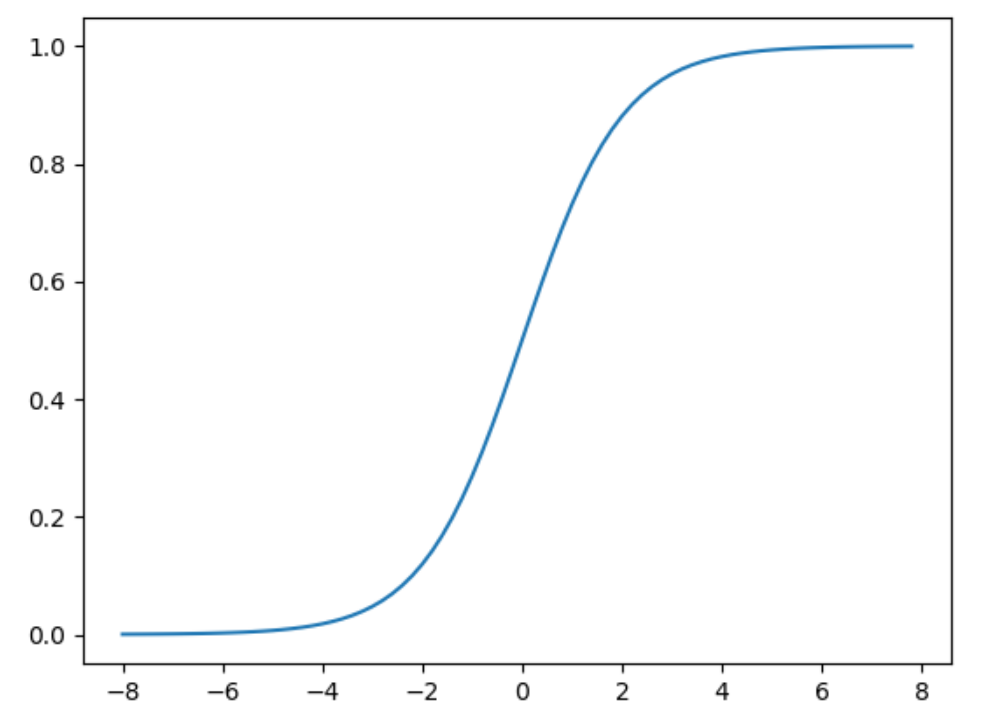
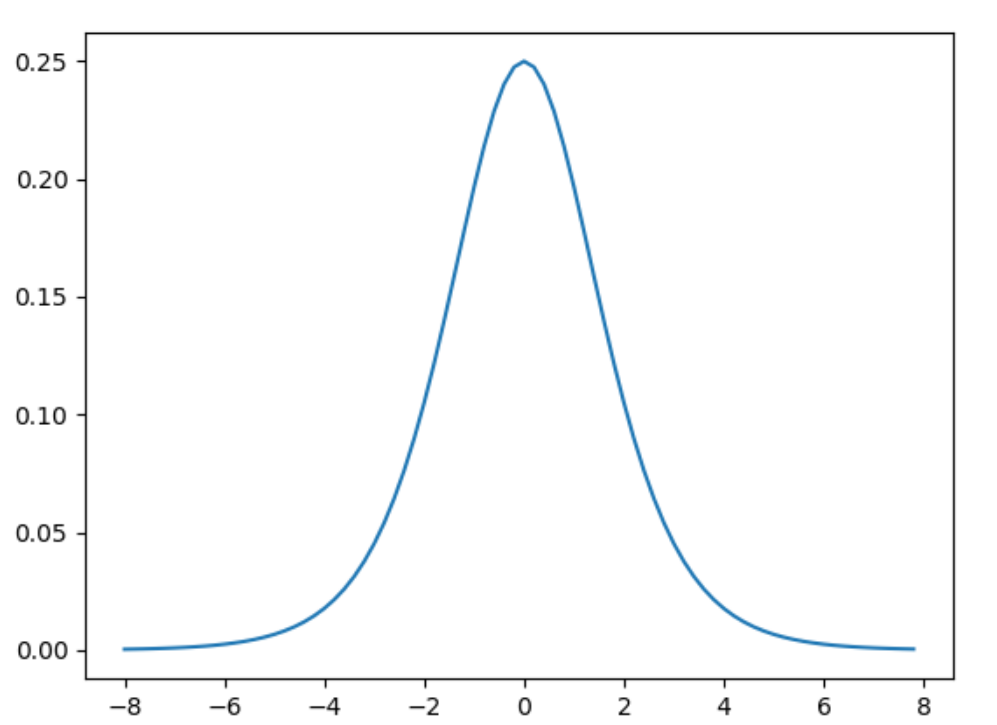
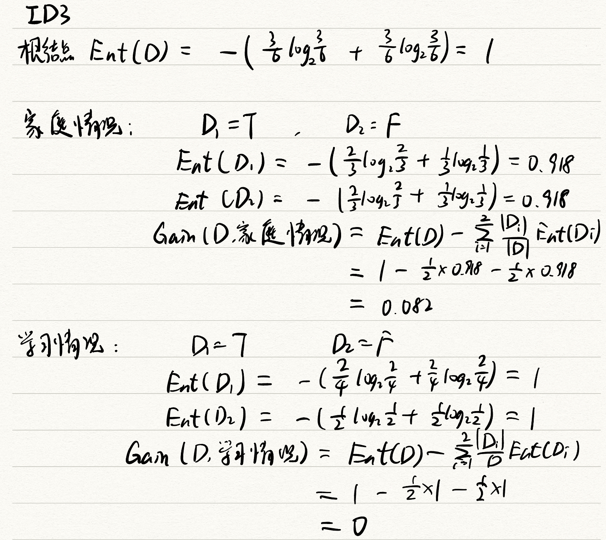

## 2020机器学习试卷回忆

### 简述SVM核心思想；介绍什么是支持向量

（以下来自New Bing）

- 支持向量机（SVM）是一种二分类模型，它的基本模型是定义在特征空间上的间隔最大的线性分类器，间隔最大使它有别于感知机；SVM还包括核技巧，这使它成为实质上的非线性分类器。
- SVM的核心思想是**找到区别正负样本的边界**，使得正负样本到达这条边界的范围最大（模型泛化能力最好）。支持向量是SVM的训练结果，在SVM分类决策中起决定作用的是支持向量。
- 支持向量是指离超平面最近的且**满足一定条件的几个训练样本点**。在决定分离超平面时，只有支持向量起作用，而其他实例点不起作用

### 在SVM中会用到核函数。根据$$K(.,.):R^d×R^d \mapsto R$$， 简要介绍Mercer条件

(以下来自ChatGPT)

- Mercer 条件是指对于一个实数函数$K(x,x'):R^d\times R^d\rightarrow R$,满足以下性质:
  1. 线性可分性：对于任意两个样本$x,x'\in R^d$,如果$K(x,x')>0$,则$x$和$x'$是线性可分的。
  2. 对数可导性：对于任意$x,x'\in R^d$,如果$K(x,x')>0$,则$K(x,x')$是$x$关于$x'$的对数可导函数。
  3. 零点定理：对于任意$x,x'\in R^d$,如果$K(x,x')<0$,则$x$和$x'$之间不存在线性关系。
  4. 局部 Lipschitz 常数：对于任意$x,x',x''\in R^d$,如果$K(x,x')>0$,则$K(x,x'')$不超过$K(x,x')$加上一个局部 Lipschitz 常数。
- 其中，零点定理是最重要的一个性质，它意味着对于任意两个样本$x,x'\in R^d$,如果$K(x,x')<0$,则它们之间不存在线性关系。这对于 SVM 的核函数选择非常重要，因为只有对于任意两个样本$x,x'\in R^d$,如果$K(x,x')>0$,我们才能说它们之间存在线性关系。
- Mercer 条件是 SVM 中的一个基本假设，它保证了 SVM 的核函数$K(x,x')$满足 Mercer 条件。如果$K(x,x')$满足 Mercer 条件，那么我们可以使用 SVM 将$x$和$x'$进行分类。如果$K(x,x')$不满足 Mercer 条件，那么 SVM 可能会失效，因为它无法保证对于任意两个样本$x,x'\in R^d$,如果$K(x,x')<0$,则它们之间不存在线性关系。

### $$\sigma(x)$$为sigmoid函数

1. **证明$$\sigma(-x)=1-\sigma(x)$$**

2. **证明$$\sigma(x)$$导数为$$\sigma(x)(1-\sigma(x))$$， 并画出$$\sigma(x)$$和$$\sigma(x)$$导数的函数曲线**

|                        $$\sigma(x)$$                         |                      $$\sigma(x)$$导数                       |
| :----------------------------------------------------------: | :----------------------------------------------------------: |
|  |  |

### 平面上四个点，A(0,0), B(1,0), C(0, 1), D(1,1)，A的标签为+1，其余标签为-1。构造一个三层神经网络，初始权值均为0，运用学习算法，更新其权值。

### 两个属性：家庭条件，学习成绩，标签：是否工作。（感谢syl提供数据）

| 家庭情况（X） | 学习情况（X） | 是否工作 |
| ------------- | ------------- | -------- |
| T             | T             | 否       |
| T             | T             | 否       |
| T             | F             | 是       |
| F             | F             | 否       |
| F             | T             | 是       |
| F             | T             | 是       |

1. 计算每个属性的信息增益

2. 使用ID3算法构建决策树

   

### 写出局部线性嵌入算法LLE的原理和流程

局部线性嵌入（LLE）算法是一种经典的流形学习算法，它假设数据在小的局部区域内是线性的。它是一种无监督学习算法，可用于降维、数据可视化和特征提取。LLE算法主要有三个步骤：

1. 计算数据集中每个点的k近邻。
2. 计算最佳重构每个点及其邻居的权重。
3. 计算保留这些权重的数据集的低维表示。

LLE算法计算效率高，可用于在高维空间中学习非线性流形。

### 强化学习

一开始采取的策略均为+1

1. 写出每个点的Bellman公式
2. 计算每个值函数
3. 根据上面计算好的值函数，进行一次最优控制，计算应该采取的策略
4. 计算此时的值函数

