# 机器学习复习

第一部分：5道选择题 单选

第二部分：6道大题

- 基本上课程每个章节设置一个大题
- 需要描述算法，计算过程
- 题目基本都是客观题，回答会酌情给分
- **考试不会考简答题**，考计算，代码
- 最重要的就是掌握算法流程、模型

考察方向

- **强化学习（重点）**
- **降维和优化（重要）**
- **决策树**的度量函数，怎么构造，采用什么度量函数，**ID3信息增益**，cut构造
- 集成学习
- 神经元、深度学习
- 概率学习KNN，SVM算法，怎么样具体使用，针对一个例子怎么用算法解决问题
- 深度学习网络，针对具体问题怎么构造
- 基础的计算，求导要掌握
- EM（？），决策树算法都要掌握流程步骤

# 重点

## 1-概要

### 学习

- 利用经验改善系统的性能

### 机器学习

- 严格定义
  - 学习是一个蕴含特定目的的知识获取过程，其内部表现为新知识的不断建立和修正，而外部则表现为性能改善。
- 通俗定义
  - 任何通过数据训练的学习算法都属于机器学习

### 数据类型或特点

- 静态与动态（如照片与视频等）
- 小数据与大数据（如异常&正常+类不平衡/代价敏感）
- 同质与异质（如实数型与符号&实数的混合）
- 单态与多态（如仅图像与声音&图像）
- 小类数与大类数（如性别与个体识别）
- 缺失&带噪数据
- 高维数据&非数值数据（如串、图）

### 模型和学习层面

- 模型
  - 形式：线性、非线性
  - 体系：浅层、深度、递归
- 学习
  - 经典
  - 现代
  - 混合

### 术语

- 输入
- 权重
- 输出
- 目标
- 误差
- 数据集划分
  - 留出法
  - 交叉验证
- 模型/映射函数
- 目标/损失函数
- 评测：泛化性能
- 过拟合、欠拟合、好的拟合

### 评价指标

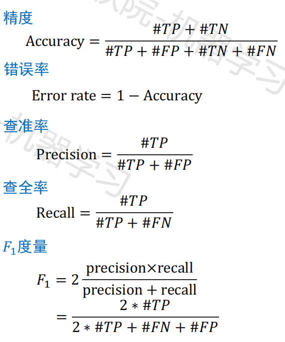

### 典型方法

1. 模型选择
2. 正则化/规整化
3. 模型组合/集成
4. 多视图方法

### 统计学基本概念

- 均值、中位数、众数

- 期望

- 方差、均方根

- 协方差

  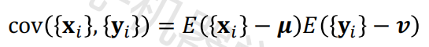

  - 如果协方差>0，说明X，Y同向变化，协方差越大说明同向程度越高；如果协方差<0，说明X，Y反向变化，协方差越小说明反向程度越高。
  - 如果协方差=0，说明X，Y独立

- 协方差矩阵

  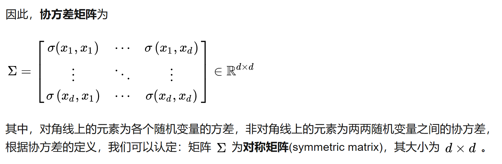

### 距离度量函数

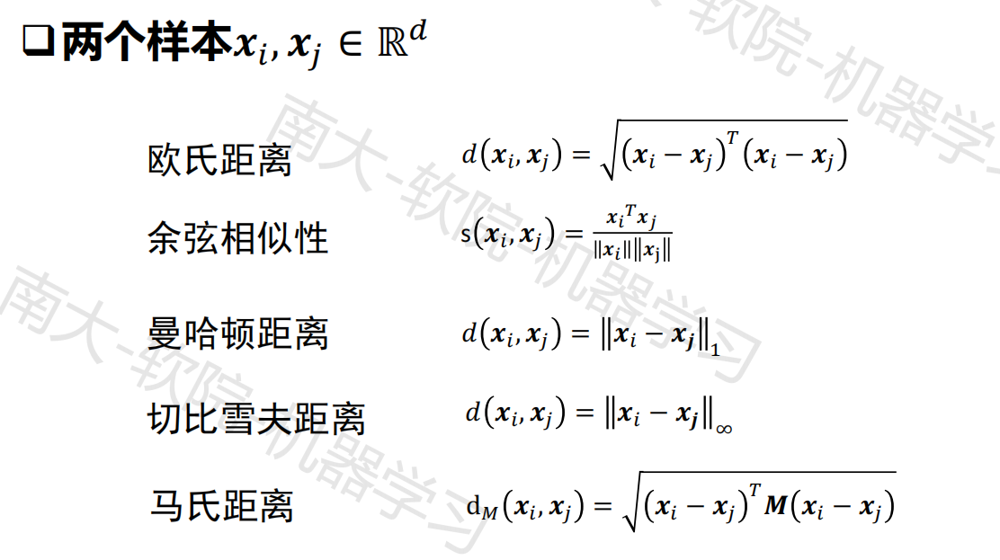

### 概率

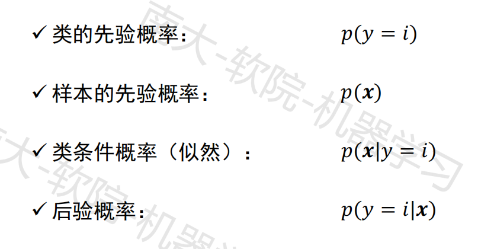

## 2-神经元和感知机

### 感知机学习规则（课件上有明确的例子）

- 见课件
- 感知机学习缺点
  - 感知机模型属于单层神经网络，不能解决一类非线性可分的问题
  - 典型的例子是异或（需要用多层网络来处理）

### 线性可分

线性可分是指能使用**线性组合组成的超平面将两类集合分开**，线性不可分则没有能将两类集合分开的超平面。例如，在二维空间中，线性可分意味着可以用一条直线将两类样本分开；在三维空间中，可以用一个平面将两类样本分开；在高维空间中，可以用一个超平面将两类样本分开。

## 3-神经网络

### 多层感知机的隐藏层

- 为什么需要隐藏层
  - 多层感知机需要隐藏层是因为隐藏层能够对输入特征进行多层次的抽象，最终目的是为了更好地线性划分不同类型的数据。隐藏层可以帮助模型学习更复杂的关系和模式，从而提高模型的预测能力。
- 如何计算隐藏层的权值
  - 反向传播算法

### 误差反向传播算法

- **Delta规则** 

  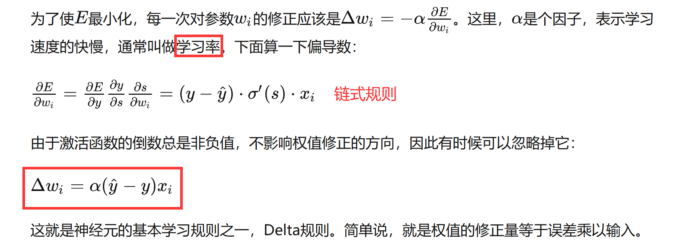

- 具体计算过程详见：**西瓜书5.3-误差逆传播算法**

- Delta规则与感知机学习规则的区别：**Δω互为相反数**

- 规则分析：学习率α控制着算法每一轮迭代中的更新步长，若**太大则容易振荡**，**太小则收敛速度又会过慢**，有时为了精确调节，会将更新输出层阈值θ、隐藏层到输出层的权值ω使用的学习率分开，使用α1，α2来调节。

### 激活函数

- sigmoid激活函数

  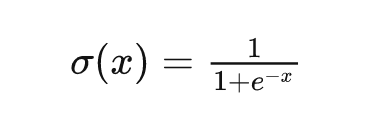

- sigmoid函数的导数

  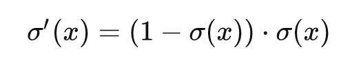

## 4-维度约简

> 重点掌握以下两个算法的**计算过程**，能手算
>
> e.g. 给一组数据计算协方差矩阵，得到PCA的值

### 线性判别分析 LDA

- 给定标注了类别的高维数据集，投影到高维的超平面，使得样本点按类别尽最大可能区分开。

- 思想：类内小，类间大

  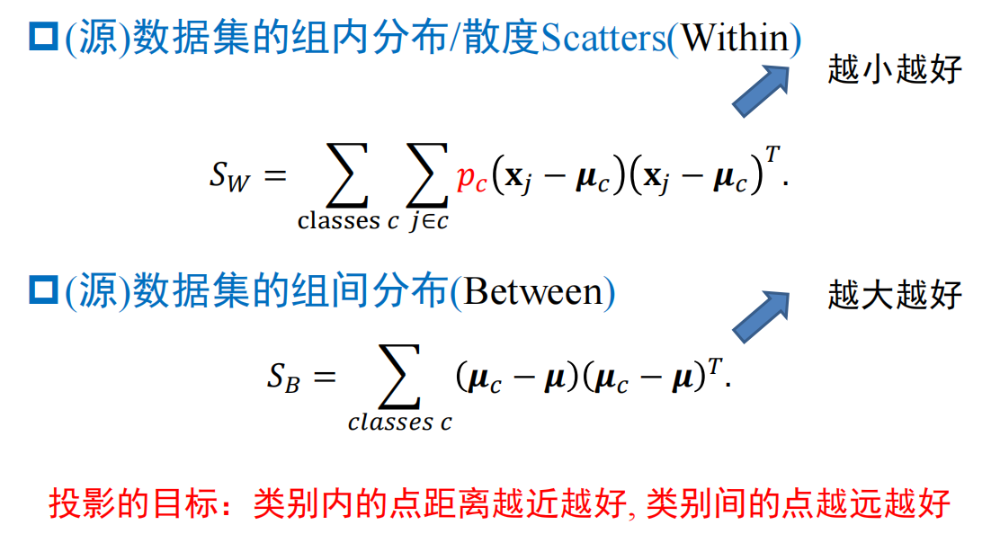

### 主成分分析 PCA

- 两个角度
  - 最近重构性（最小重构代价）
  - 最大可分性（最大投影方差）

- 算法基本流程

  - 样本去中心化
  - 计算样本的协方差矩阵
  - 对协方差矩阵做特征值分解
  - 取最大的若个个特征值所对应的特征向量
  - 用这些特征向量构成投影矩阵

- 详细流程

  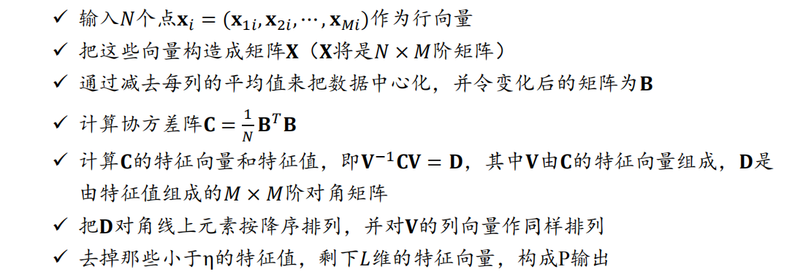

### 附：求协方差矩阵

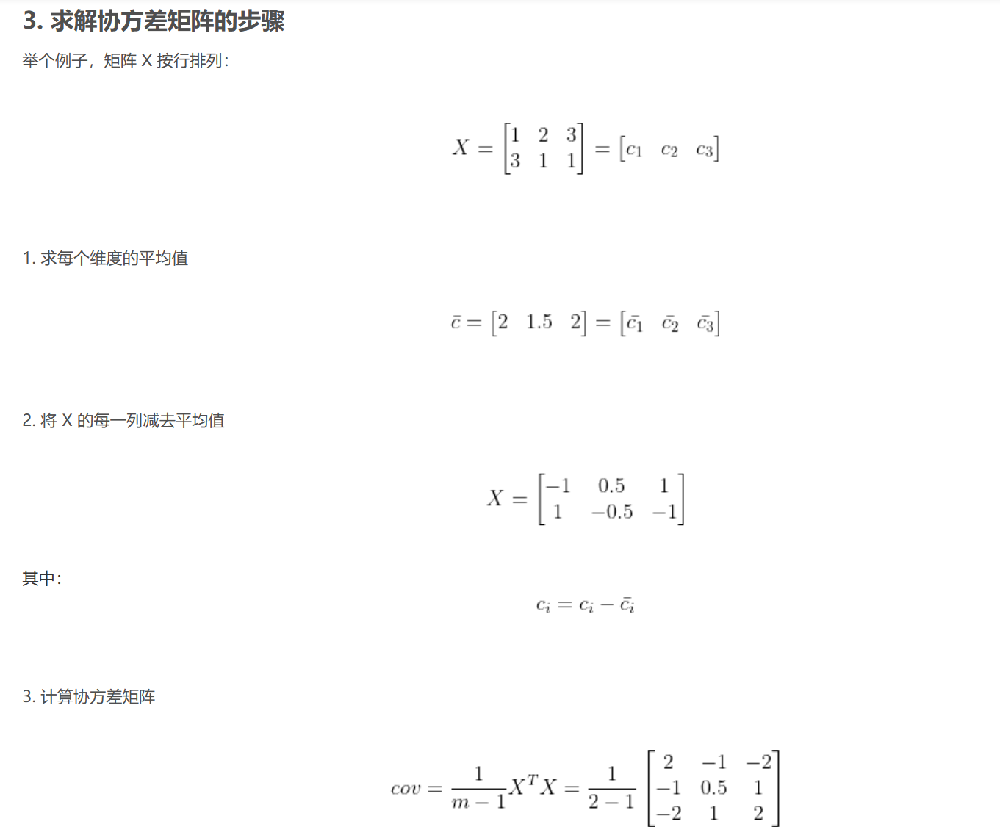

## 5-概率与学习

### EM算法

> 感兴趣可以看看

### KNN（重点）

> 掌握核心思想，擅长做什么、不擅长做什么；算法流程，核心步骤，优缺点

- 算法流程

  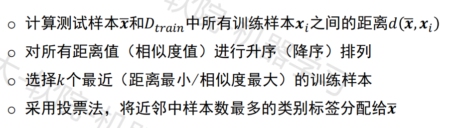

- k的取值
  - k一般取奇数值，避免平局
  - k取不同的值，分类结果可能不同
  - k值较小时，对噪声敏感，整体模型变得复杂，容易过拟合
  - k值较大时，对噪声不敏感，整体模型变得简单，容易欠拟合

- 优点

  - 精度高
  - 对异常值不敏感
  - 无数据输入假定（无监督）

- 缺点

  - 计算复杂度高
  - 空间复杂度高

- 讨论

  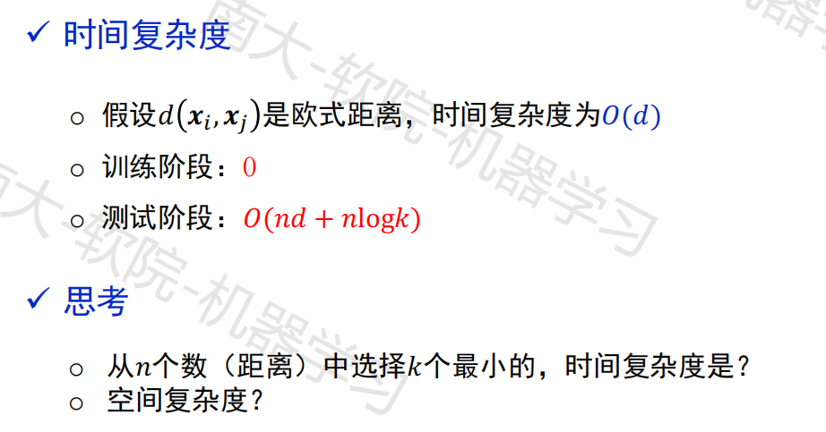

## 6-支持向量机 SVM

- 分类器是一个分离超平面

- 最重要的训练样本是“支持向量”，它们定义了超平面，而其他样本被忽略了。

## 7-优化和搜索

### 梯度下降

> （考试不会特别关注）

### 牛顿法 

解析式求解  “泰勒展开”

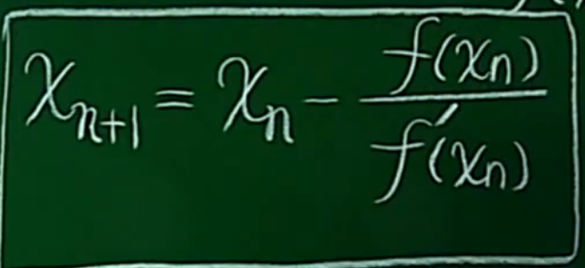

### 最小二乘优化

> 损失函数要掌握，考试会给一个函数来计算

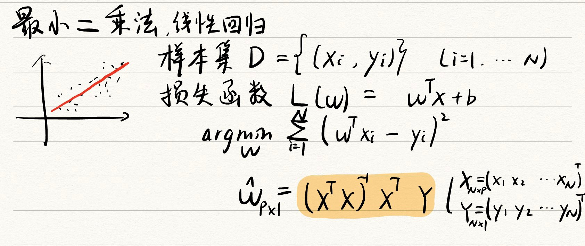

## 8-演化学习

> 这一章不考察

## 9-强化学习

- **例-策略评估** 考试会改造书上/课件上的例子，怎么计算**值函数，贝尔曼公式构造，值函数求解，最新的策略如何产生**

- bellman公式

  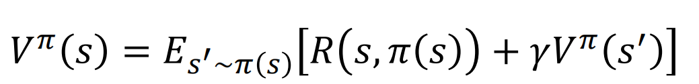

## 10-树学习

### ID3算法（重要）

> 会给一个实际例子，一组数据，**根据数据构造ID3决策树算法**

- 决策树的提出收到了信息论的启发

- 信息熵计算

  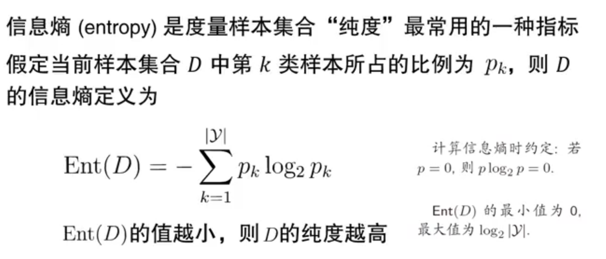

- 信息增益计算

  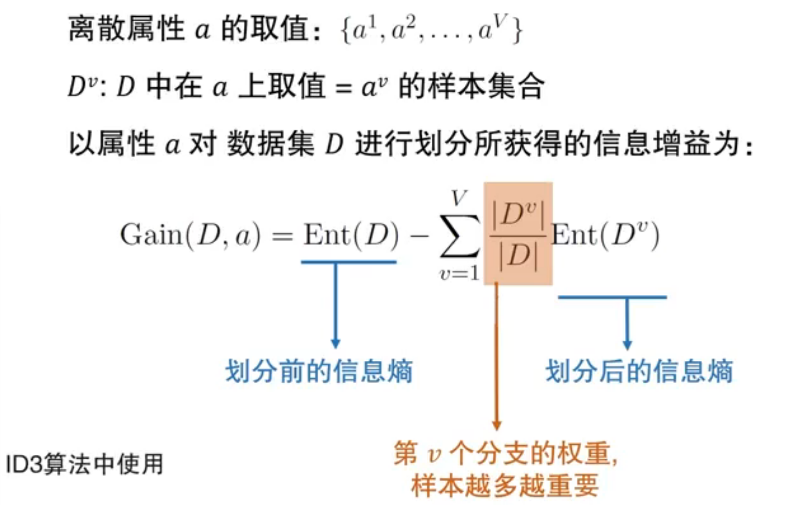

### C4.5

### 决策树的剪枝

- 预剪枝
- 后剪枝
- 样本属性缺失的处理

### 树学习算法

#### 优点

- 简单直观，生成的决策树很直观。相比于神经网络之类的黑盒分类模型，决策树在逻辑上可以很好解释，可解释性强。
- 基本不需要预处理，不需要提前归一化和处理缺失值。既可以处理离散值又可以处理连续值。很多算法只是专注于离散值或者连续值。
- 可以处理多维度输出的分类问题。
- 使用决策树预测的代价是O(log2m)。m为样本数
- 可以交叉验证的剪枝来选择模型，从而提高泛化能力
- 对于异常点的容错能力好，健壮性高。

#### 缺点

- 树算法非常容易过拟合，导致泛化能力不强。可以通过设置节点最少样本数量和限制决策树深度来改进。
- 决策树会因为样本发生一点的改动，导致树结构的剧烈改变。可以通过集成学习之类的方法解决。
- 寻找最优的决策树是一个NP难题，通过启发式方法，容易陷入局部最优。可以通过集成学习的方法来改善。
- 比较复杂的关系（如异或），决策树很难学习，一般这种关系只能用其他学习方法（如神经网络）来解决。
- 如果某些特征的样本比例过大，生成决策树容易偏向这些特征。可以通过调节样本权值来改善。

## 11-集成学习

- Boosting
- Bagging

## 12-无监督学习

- 经典的概念
- 精确度，准确率，召回率这些常用的评价指标（掌握）

### kmeans

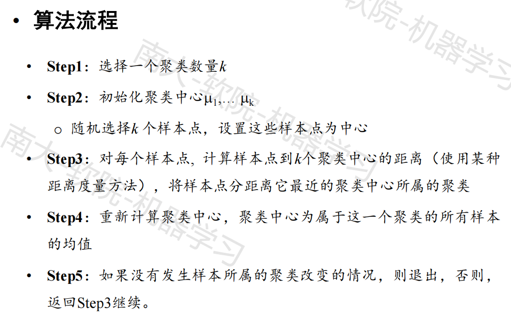

