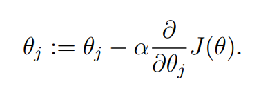
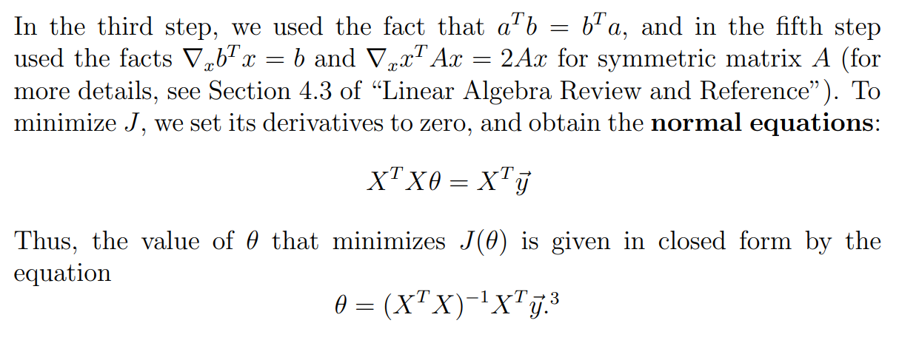
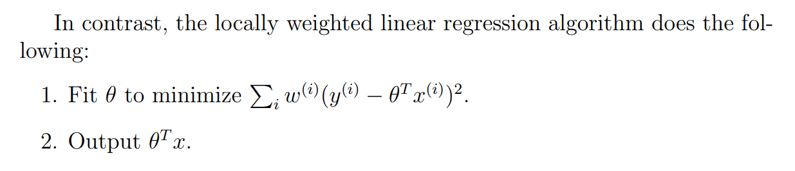
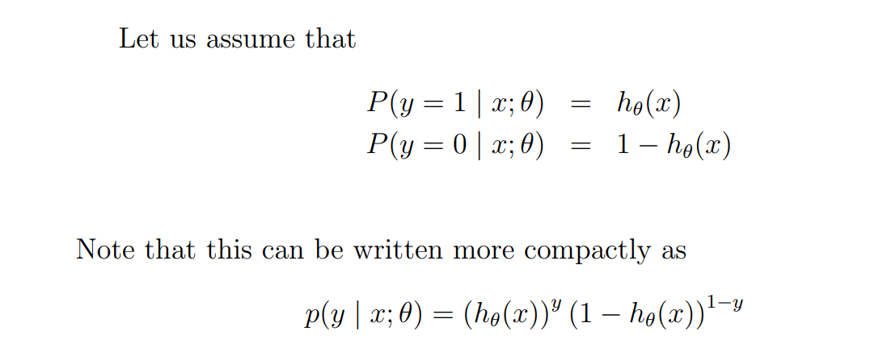
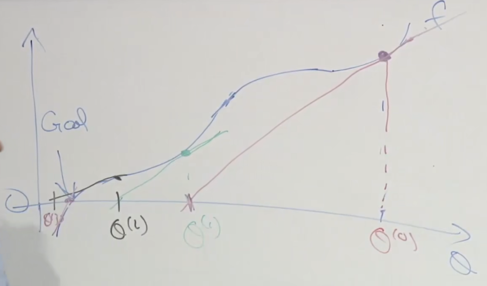

# CS229 Machine Learning (Autumn 2018)

## Lecture 1 Welcome

### 1.1 Goal of this class

- 在不同领域应用ML，实现自己的理想

### 1.2 Prerequisites 先决条件

- 计算机基础知识
- 算法，数据结构
- 概率论
- 线性代数

### 1.3 变化

- 从Matlab、Octave转为使用Python、Numpy

### 1.4 Definition

ML: Field of study that gives computers the ability to learn without being explicitly programmed.(Arthur Samuel)

### 1.5 Supervised Learning 监督学习

- 给定样本X和标签Y，得到样本与标签的映射关系
- 最简单的是回归问题(Regression Problem)，例如房屋价格预测
- 分类问题(Classification)，例如不同大小的肿瘤属于良性或恶性，或者癌症与年龄、肿瘤大小的关系。

### 1.6 Unsupervised Learning 无监督学习

- given data with no labels, separate data into groups
- e.g. 分离人声和背景声，图像分割，社交网络分组，文本分析

### 1.7 Reinforcement Learning 强化学习

- e.g. 训练狗的正确行为，让AI玩游戏，机器人动作

## Lecture 2 Linear Regression and Gradient Descent

### 2.1 Linear Regression 线性回归

输入training set，得到一个hypothesis，然后这个hypothesis可以对每一个input得到一个output

`h(x)=Σθjxj`，其中h表示hypothesis，j从0到n，n是样本的features个数。x是输入样本，y是输出。

目标是选择参数θ，最小化成本函数`J(θ) = 1/2 * Σ(h(x)-y)^2`。这个1/2的意义是在求导时简化计算。

### 2.2 Gradient Descent 梯度下降

> We want to choose θ so as to minimize J(θ). To do so, let’s use a search algorithm that starts with some “initial guess” for θ, and that repeatedly changes θ to make J(θ) smaller, until hopefully we converge to a value of θ that minimizes J(θ). Specifically, let’s consider the gradient descent algorithm, which starts with some initial θ, and repeatedly performs the update:

​	

- 其中α是学习率。
- 梯度下降得到的是局部最小值，而非全局最小值。
- 不同的initial guess会导致不同的结果。

### 2.3 Normal Equation

## Lecture 3 

### 3.1 Locally Weighted Regression 局部加权回归

#### 术语

- parametric learning algorithms (e.g.线性回归)
- non-parametric learning algorithms (e.g. 局部加权回归)

#### 在原有的代价函数上加一个w表示权值

- if |xi - x| is small, wi -> 1

- if |xi - x| is large, wi -> 0

#### 场景

- 样本的features不是很多，并且无法用一个函数去拟合样本，就采用局部加权回归的方式，只看input的附近样本。

### 3.2 Probabilistic Interpretation

- IID：独立同分布，independent and identically distributed。在概率统计理论中，如果变量序列或者其他随机变量有相同的概率分布，并且互相独立，那么这些随机变量是独立同分布。

- likelihood of parameters
- probability of data
- MLE：Maximum Likelihood Estimation 极大似然估计

### 3.3 Classification

- 用linear regression来进行分类显然是不合理的
- 常用的是logistic regression

### 3.4 Newton's Method

- Given function f, find θ, let f(θ) = 0

- find θ, let f'(θ) = 0

  

- 特性：Quadratic Convergence 二次收敛,每次收敛的精确度会翻倍（0.01 --> 0.0001） 

## Lecture 5 GDA Naive Bayes

### Generative Learning Algorithm

