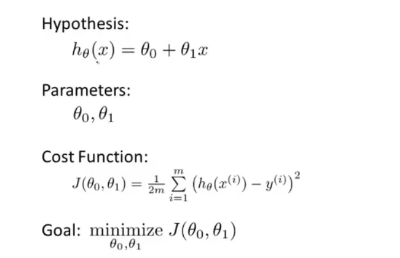
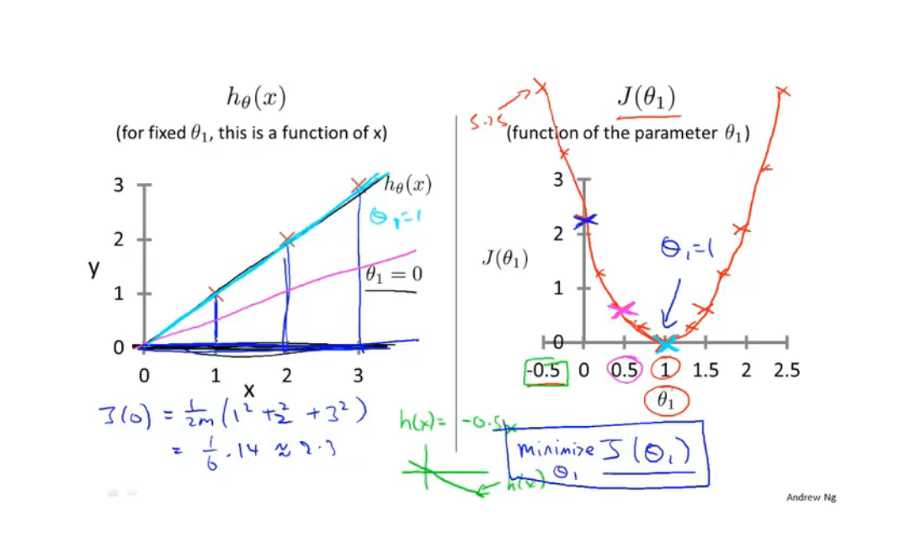
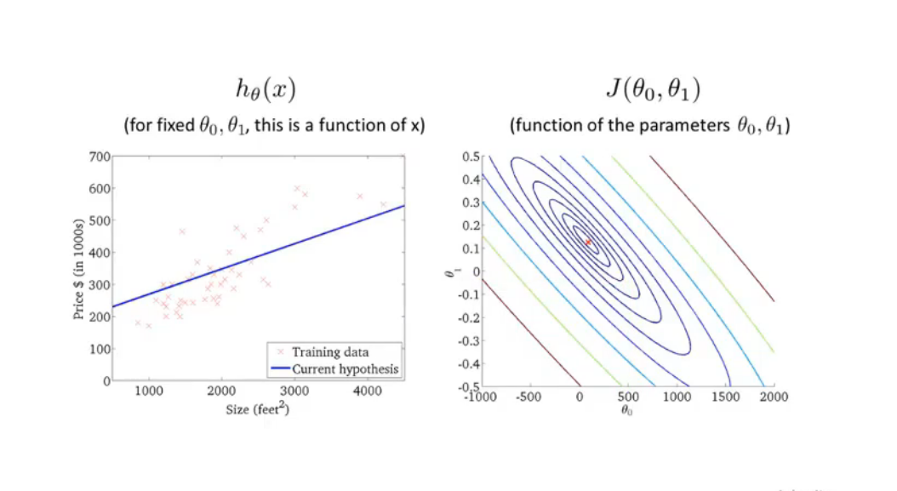
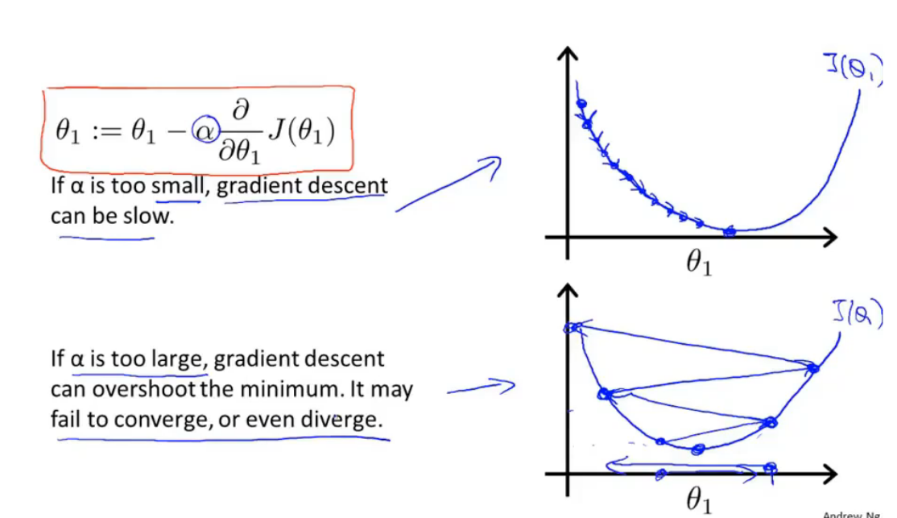
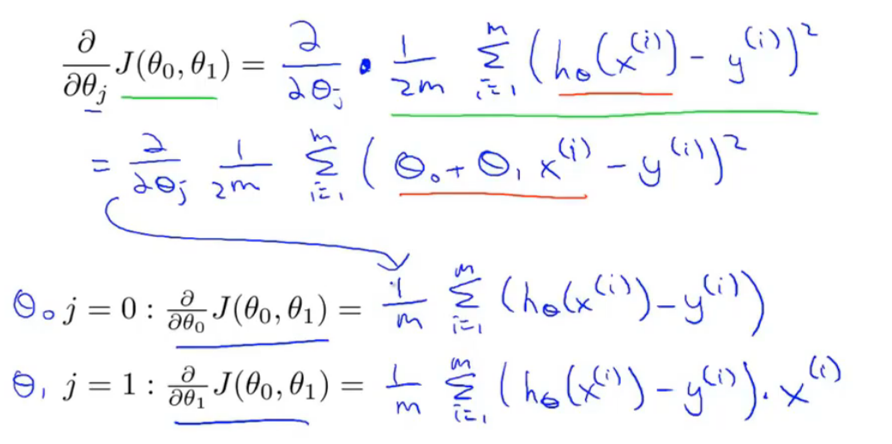
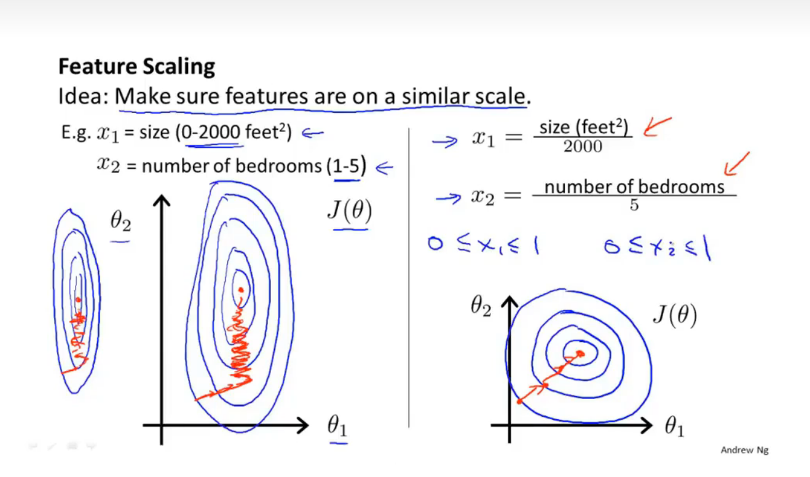
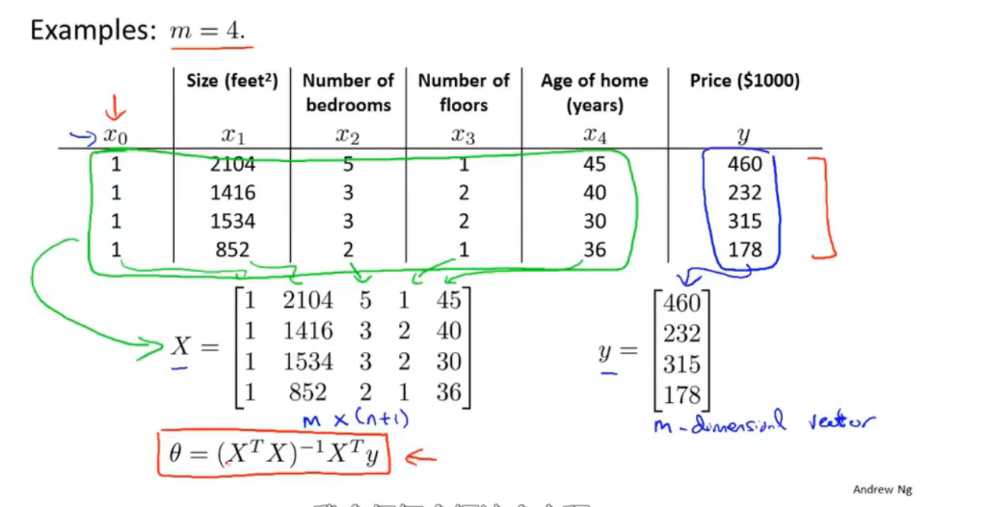

# Machine Learning

> teached by 吴恩达

## 1. 机器学习概述

### 1.1 引入

### 1.2 什么是机器学习

#### 定义

#### 分类

- 监督学习 Supervised learning
- 非监督学习 Unsupervised learning

### 1.3 监督学习

- 给定数据集，预测数据
- 回归问题 regression problem
- 分类问题 classification problem

### 1.4 无监督学习

- 只给了数据，数据没有标签或者有相同的标签

- 聚类问题 clustering problem

## 2. 线性回归

### 2.1 线性回归模型

根据已有数据构建一个拟合模型hypothesis，从而利用这个函数进行预测，h(input) -> output。

### 2.2 代价函数

- 如何确定拟合函数中的参数：计算对于某一组样本(x,y)的(h(x) - y)^2，当**所有样本到拟合函数的距离平方和**（称为**代价函数J**）最小，则函数的拟合最佳。

### 2.3 代价函数（一）

- 一个例子 **J(θ\_1) = θ\_1* X**

### 2.4 代价函数（二）

- 一个例子**J(θ\_0,θ\_1) = θ\_0 * X + θ\_1**

### 2.5 梯度下降

- 从初始值θ\_0，θ\_1开始
- 不断改变θ\_0，θ\_1从而减小J(θ\_0，θ\_1)，直到J取到最小值。

### 2.6 梯度下降算法总结

### 2.7 线性回归的梯度下降

- also called "Batch" Gradient Descent

## 3. 线性代数

### 3.1 矩阵和向量

- 矩阵的维数是行数 * 列数
- 向量是n*1维矩阵

### 3.2 矩阵加法和标量乘法

- A+B前提是矩阵A，B同维
- kA结果是A的每个元素乘以k

### 3.3 矩阵向量乘法

- 注意相乘的条件

### 3.4 矩阵乘法

- [m*n] * [n*r] = [m\*r]

### 3.5 矩阵乘法特征

- 不满足交换律：A x B ≠ B x A
- 满足结合律
- Identity Matrix

### 3.6 矩阵的逆和转置

- 在机器学习中一般不考虑矩阵不可逆的情况

## 4. 多元线性回归

### 4.1 多功能

- 多元线性回归，影响hypothesis的变量不止一个
- 用向量乘矩阵表示hypothesis

### 4.2 多元梯度下降法

- update rules和一维的很相似

### 4.3 特征缩放

- 对于若干参数的取值范围相差很大的情况，可以进行适当缩放。

  

- 一般把特征的取值确定在-1~1之间比较合适，同一数量级且接近这个范围的也可以，如-2~0.5。

### 4.4 学习率

- Debugging
- learning rate α决定了J(θ)的变化速度。
- 如果α太小，导致收敛很慢。
- 如果α太大，J(θ)可能不会持续减小，可能不会收敛。

### 4.5 特征和多项式回归

- choice of feature
- 根据数据特征选择一次，二次，三次函数或者平方根函数等。

### 4.6 正规方程

- 通过这个方程可以求出令J(θ)最小的θ值。
- 相比梯度下降算法，正规方程不需要特征缩放，也不需要选择α。
- 但是如果n非常大，这个方法会比梯度下降法慢。

### 4.7 正规方程在矩阵不可逆的情况

- 如果(X' X)不可逆，删去一些多余的特征项，或者正则化(regularization)。

## 5. Octave

> 基本操作介绍

## 6. Logistic Regression 逻辑回归

### 6.1 分类

- 二分类问题
- 多分类问题
- 用线性回归来解决分类问题一般很难得到可靠的结果

### 6.2 假设陈述

- 根据样本x，可以得到预测量y=1(或y=0)的概率
- 在同一个样本的前提下，y=1和y=0的概率和为1

### 6.3 决策界限

- 设定一个阈值，当预测量**h**大于等于这个阈值，y=positive，**h**小于这个阈值则y=negative。
- 这个阈值称为决策界限(decision boundary)，是假设函数h的一个属性。

### 6.4 代价函数

- 使用一个新的代价函数来计算，以保证Cost function随着h的变化是凸函数。

  

### 6.5 简化代价函数

- 简化后：Cost(h,y) = -y\*log(h) - (1-y)\*log(1-h)

### 6.6 高级优化

