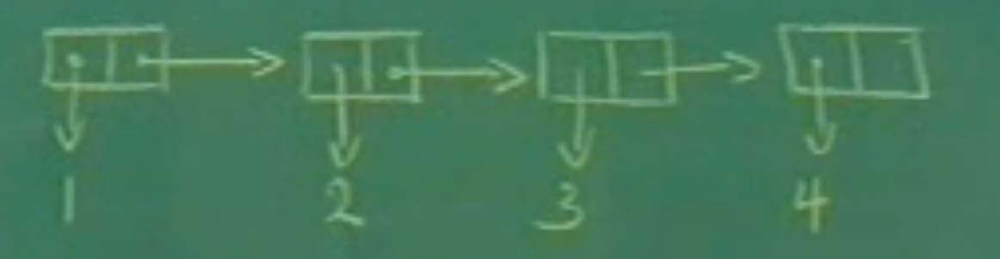

# SCIP-MIT

## Lec1a Lisp概览

### 三个重要主题

- Black Abstraction 黑盒抽象
- Conventional Interface 通用接口
- Meta-linguistic Abstraction 元语言抽象
  - Apply-Eval

### Lisp概览

- Primitive Elements

- Means of Combination

  - cond, if, ()

- Prefix Notation 前缀表示法

  例：

  ```lisp
  (+ 3 (* 5 6) 8 2) -> 43
  ```

- Means of Abstraction

  - define

  ```scheme
  //定义symbol
  (define A (* 5 5))
  (* A A) -> 625
  
  //定义procedure
  (define (square X) (* X X)) //syntactic sugar
  (square 10) -> 100
  
  //也可以这样定义
  (define square 
          (λ (X) (* X X) ))
  
  //定义绝对值
  (define (abs X)
          (COND ((< X 0) (- X))
          	  ((= X 0) 0)
                ((> X 0) X)) )
  
  //也可以这样定义绝对值
  (define (abs x)
      (if (< x 0)
          (- x)
          x))
  ```

- 求平方根

  ```scheme
  (define (sqrt x) (try 1 x))
  
  //guess是变量，try是一个recursive definition
  (define (try guess x)
      (if (good-enough? guess x)
          guess
          (try (improve guess x)x)))
  
  (define (improve guess x)
      (average guess (/ x guess)))
  
  (define (good-enough? guess x)
      (< (abs (- (square guess) x))
         .001))
  
  //average和abs的定义略
  ```

  

## Lec1b 计算过程

- Kinds of Expressions

  - numbers
  - symbols
  - λ-expressions
  - definitions
  - combinitions

- How to evaluate an expression?

- 皮亚诺算术

  ```scheme
  //Iteration 迭代
  //time = O(x)
  //space = O(1)
  (define (+ x y)
      (if (= x 0)
          y
          (+ (-1+ x) (1+ y))))
  
  //Linear Recursion 线性递归
  //time = O(x)
  //space = O(x) 
  (define (+ x y)
      (if (= x 0)
          y
          (1 + (+ (-1+ x) y))))
  ```

- 斐波那契数列

  ```scheme
  //time = O(fib(n))
  //space = O(n)
  (define (fib n)
      (if (< n 2)
          n
          (+ (fib (- n 1))
             (fib (- n 2)))))
  ```

- 汉诺塔Towers of Hanoi

   ```scheme
   
   (define (move n from to spare)
       (cond ((= n 0) "DONE")
           (else 
            (move (-1+ n) from spare to)
            (print-move from to)
            (move (-1+ n) spare to from))))
   ```

  

## Lec2a 高阶过程

代码示例

```scheme
//求a到b的所有整数和
(define (sum-int a b)
    if (> a b)
    0
    (+ a
       (sum-int (1+ a) b))))

//抽象过程
(define (<name> a b)
    (if (> a b)
        0
        (+ (<term> a)
           (<name> (<next> a) b))))

(define (sum term a next b)
    (if (> a b)
        0
        (+ (term a)
           (sum term
                (next a)
                next
                b))))

//牛顿法求平方根
(define (sqrt x)
    (Newton (λ(y)(- x (square y)))
            1))

(define (Newton f guess)
    (define df (deriv f))
    (fixed-point
     (λ(x)(- x (/ (f x)(df x))))
     guess))

(define deriv
    (λ (f)
       (λ(x)
         (/ (- (f (+ x dx))
               (f x))
            dx))))

(define dx 0.000001)
```

- 语义学

  The rights and privileges of first-class citizens:

  1. To be named by variables
  2. To be passed as arguments to procudures
  3. To be returned as values of procedures
  4. To be incorporated into data structures


## Lec2b 复合数据

### 有理数

- 如何表达有理数？

  ```scheme
  //有理数constructor
  (make-rat n d) --> R
  
  //分子selector
  (numer R) --> n
  
  //分母selector
  (denom R) --> d
  
  //分数加法
  (define (+rat x y)
      (make-rat
       (+ (* (numer x)(denom y))
          (* (numer y)(denom x)))
       (* (denom x)(denom y))))
  
  //分数乘法
  (define (*rat x y)
      (make-rat
       (* (numer x)(numer y))
       (* (denom x)(denom y))))
  ```

- CONS、CAR、CDR 有序对

  ```scheme
  (cons x y)
  	constructs a pair whose first part is x and 	second part is y
  (car p)
  	selects the first part of the pair p
  (cdr p)
  	selects the second part of the pair p
  
  (car (cons x y)) is x
  (cdr (cons x y)) is y
  ```

- 使用cons定义有理数
  
  ```scheme
  (define (make-rat n d)
        (cons n d))
  
  (define (numer x)(car x))
  
  (define (denom x)(cdr x))
  
  //优化后的make-rat
  (define (make-rat n d)
      (let ((g (gcd n d)))      //let用于定义局部变量
           (cons (/ n g)
                 (/ d g))))
  ```
  
- Abstraction Layer

  ```
     +RAT   *RAT   -RAT
  ========================
    make-rat numer denom      --> data abstraction
  ========================
          pairs
  ```

### 坐标和向量

- 定义vectors

  ```scheme
  (define (make-vector x y) (cons x y))
  
  (define (xcor p) (car p))
  
  (define (ycor p) (cdr p))
  ```

- 定义segments

  ```scheme
  (define (make-seg p q) (cons p q))
  
  (define (seg-start s) (car s))
  
  (define (seg-end s) (cdr s))
  ```

- Closure 闭包 

  > CONS can not only build a pair of numbers, but also a pair of pairs.

### 抽象的本质

```scheme
(define (cons a b)
    (λ (pick)
       (cond ((= pick 1) a)
           	 ((= pick 2) b))))

(define (car x) (x 1))

(define (cdr x) (x 2))
```


## Lec3a Escher的例子

- List

  

  ```scheme
  (cons 1
        (cons 2
              (cons 3
                    (cons 4 nil))))
  //等价于:
  (define 1-TO-4 (LIST 1 2 3 4))
  
  (car (cdr (cdr 1-TO-4))) --> 3
  
  1-TO-4 --> (1 2 3 4)
  
  (cdr (cdr 1-TO-4)) --> (3 4)
  ```

- 把List的每个值乘以一个数

  ```scheme
  (define (scale-list s l)
      (if (null? l)
          nil
          (cons (* (car l) s)
                (scale-list s (cdr l)))))
  
  (define (scale-list s l)
      (map (λ(item) (* item s))
           l))
  ```

- for-each

  ```scheme
  //对list的每一个元素使用proc
  (define (for-each proc list)
      (cond ((null? list) "done")
          (else (proc (car list))
                (for-each proc
                          (cdr list)))))
  ```

- A picture language enbedded in Lisp

  - primitives: picture
  - means of combination: above, rotate, beside, right-push...

  ```scheme
  (define (beside p1 p2 a)
      (lambda (rect)
              (p1 (make-rect
                   (origin rect)
                   (scale a (horiz rect))
                   (vert rect)))
              (p2 (make-rect
                   (+vect (origin rect)
                          (scale a (horiz rect)))
                   (scale (- 1 a) (horiz rect))
                   (vert rect)))))
  ```


## Lec3b 符号化求导程序

- 递归求导

  ```scheme
  (define (deriv exp var)
      (cond ((constant? exp var)  0)
            ((same-var? exp var) 1)
            ((sum? exp)
             (make-sum (deriv (A1 exp) var)
                       (deriv (A2 exp) var)))
            (product? exp)
             (make-sum
               (make-product (M1 exp)
                             (deriv (M2 exp) var))
               (make-product (deriv (M1 exp) var)
                             (M2 exp)))))
  
      
  (define (constant? exp var)
      (and (atom? exp)
           (not (eq? exp var))))
      
  (define (sum? exp)
      (and (not (atom? exp))
           (eq (car exp) '+)))) //注意这个引号的语义
  
  (define (make-sum a1 a2)
      (LIST '+ a1 a2))
  
  (define a1 cadr) //cadr means car cdr
  
  (define a2 caddr)
  
  (define (product? exp)
      (and (not (atom? exp))
           (eq (car exp) '*)))
  
  (define (make-product m1 m2)
      (LIST '* m1 m2))
  
  (define m1 cadr)
  
  (define m2 caddr)
  ```

  

## Lec4a 模式匹配

- Pattern Matching 模式匹配

  Pettern --> Skeleton (by rules)
  
  ```scheme
  (define (match pattern exp dict)
      (cond ((eq? dict 'failed) 'failed)
            ((atom? pattern)
             *** Atomic patterns)
            *** Pattern variable clauses
            ((atom? exp) 'failed)
            (else
             (match (cdr pattern)
                    (cdr exp)
                    (match (car pat)
                           (car exp)
                           dict)))))
  ```

- Instantiation 实例化

  ```scheme
  (define (instantiate skeleton dict)
      (define (loop s)
          (cond ((atom? s) s)
                ((skeleton-evaluation? s)
                 (evaluate (eval-exp s) dict))
               (else (cons (loop (car s))
                           (loop (cdr s))))))
      (loop skeleton))
  
  (define (evaluate from dict)
    (if (atom? form)
        (lookup form dict)
        (apply
         (eval (lookup (car form) dict)
               user-initial-environment)
         (mapcar (λ (v)
                    (lookup v dict))
                 (cdr form)))))
  ```

  


